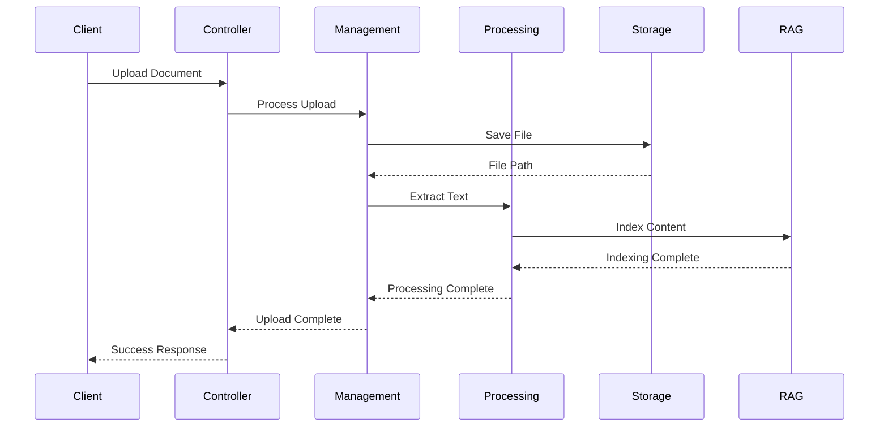

# RAG Document Processing Architecture

## Directory Structure

```
ConversationService/
├── Controllers/
│   └── Document/
│       ├── DocumentController.cs
│       └── Validators/
│           └── DocumentRequestValidator.cs
├── Services/
│   └── Document/
│       ├── DTOs/
│       │   ├── Requests/
│       │   │   ├── UploadDocumentRequest.cs
│       │   │   └── ProcessDocumentRequest.cs
│       │   └── Responses/
│       │       ├── AttachmentResponse.cs
│       │       └── ProcessingResponse.cs
│       ├── Interfaces/
│       │   ├── IDocumentManagementService.cs
│       │   └── IDocumentProcessingService.cs
│       ├── Implementation/
│       │   ├── DocumentManagementService.cs
│       │   └── DocumentProcessingService.cs
│       └── Processors/
│           ├── Base/
│           │   └── IDocumentProcessor.cs
│           ├── PDF/
│           │   └── PdfDocumentProcessor.cs
│           ├── Text/
│           │   └── TextDocumentProcessor.cs
│           ├── Word/
│           │   └── WordDocumentProcessor.cs
│           └── Markdown/
│               └── MarkdownDocumentProcessor.cs
├── Infrastructure/
│   └── Document/
│       ├── Storage/
│       │   ├── IDocumentStorage.cs
│       │   └── FileSystemDocumentStorage.cs
│       ├── Options/
│       │   └── DocumentManagementOptions.cs
│       └── Exceptions/
│           ├── DocumentException.cs
│           ├── DocumentProcessingException.cs
│           ├── DocumentStorageException.cs
│           └── UnsupportedDocumentTypeException.cs
└── Tests/
    └── Document/
        ├── Unit/
        │   ├── Services/
        │   │   └── DocumentProcessingTests.cs
        │   └── Processors/
        │       └── ProcessorTests.cs
        └── Integration/
            └── DocumentManagementTests.cs
```

## Component Responsibilities

### Controllers Layer

#### DocumentController
- Handles HTTP requests for document operations
- Implements API endpoints for CRUD operations
- Manages request validation and authorization
- Routes requests to appropriate services

### Service Layer

#### Document Management Service
- Handles document lifecycle management
- Coordinates storage and database operations
- Manages document metadata
- Implements business logic for document operations

#### Document Processing Service
- Manages document text extraction
- Coordinates between different document processors
- Handles chunking and RAG preparation
- Manages processing pipeline

#### Document Processors
- Format-specific text extraction
- Metadata extraction
- Format validation
- Content preprocessing

### Infrastructure Layer

#### Storage
- File system operations
- Path management
- Security checks
- Cleanup procedures

#### Options
- Configuration management
- Feature toggles
- Processing settings
- Security settings

## Data Flow



## Integration Points

### 1. Database Integration
```csharp
public interface IAttachmentRepository
{
    Task<Attachment> CreateAsync(Attachment attachment);
    Task<Attachment> GetByIdAsync(string id);
    Task<IEnumerable<Attachment>> GetByConversationIdAsync(string conversationId);
    Task<bool> DeleteAsync(string id);
}
```

### 2. RAG Integration
```csharp
public interface IRagIndexingService
{
    Task IndexDocumentAsync(string documentId, IEnumerable<TextChunk> chunks);
    Task DeleteDocumentAsync(string documentId);
}
```

### 3. Storage Integration
```csharp
public interface IDocumentStorage
{
    Task<string> SaveAsync(Stream fileStream, string fileName);
    Task<Stream> GetAsync(string filePath);
    Task DeleteAsync(string filePath);
    Task<bool> ExistsAsync(string filePath);
}
```

## Security Architecture

1. **Upload Security**
   - Content type validation
   - File size limits
   - Antivirus scanning
   - Path traversal prevention

2. **Access Control**
   - JWT validation
   - Role-based access
   - Resource ownership validation
   - Secure file access paths

3. **Storage Security**
   - Encrypted file storage
   - Secure file paths
   - Access logging
   - Cleanup policies 