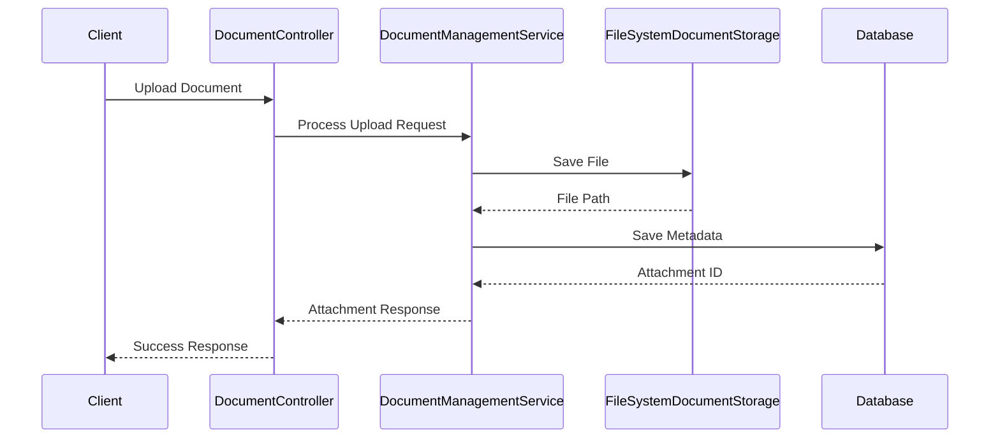
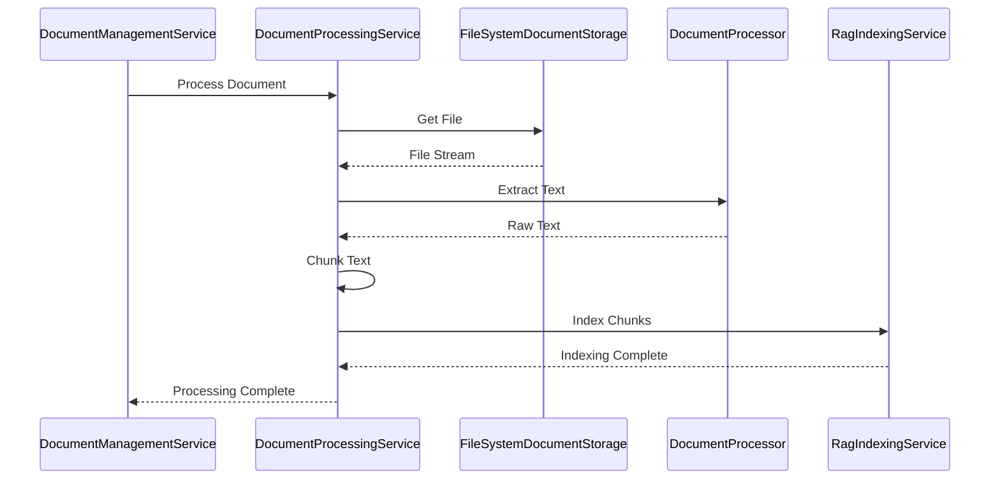
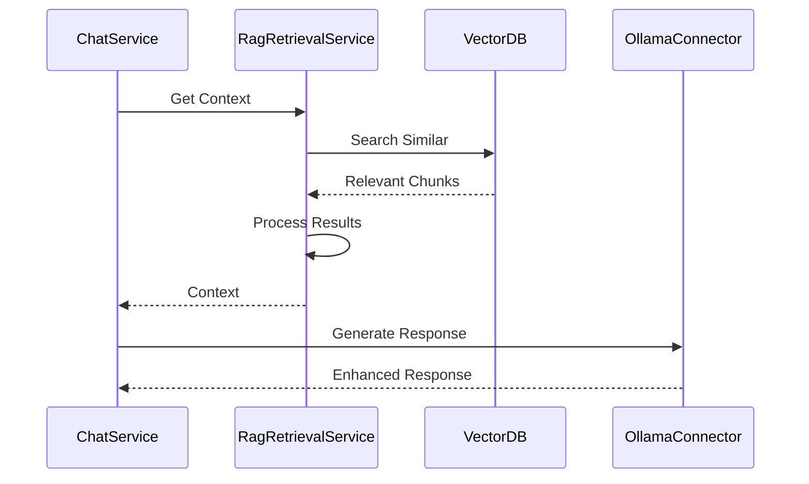

# RAG Document Processing Flow

## Document Upload Flow

## Document Processing Flow

## RAG Integration Flow

## Process Steps

### 1. Document Upload
1. Client sends document with conversation ID
2. Validate request (size, type, etc.)
3. Generate secure file path
4. Save file to storage
5. Create attachment record
6. Return attachment metadata

### 2. Document Processing
1. Retrieve document from storage
2. Identify appropriate processor
3. Extract text content
4. Extract metadata
5. Chunk text for RAG
6. Index chunks in vector database

### 3. RAG Integration
1. Receive chat query
2. Search vector database
3. Retrieve relevant chunks
4. Process and rank results
5. Include context in prompt
6. Generate enhanced response

## Error Handling

### Upload Errors
- File too large
- Invalid content type
- Storage failure
- Database error

### Processing Errors
- File not found
- Extraction failure
- Processing timeout
- Indexing failure

### RAG Errors
- Search failure
- Context processing error
- Response generation error

## Security Checks

### Upload Security
1. Validate file size
2. Validate content type
3. Scan for malware
4. Check user permissions

### Processing Security
1. Verify file access
2. Validate processing request
3. Check resource limits

### RAG Security
1. Validate context access
2. Check conversation ownership
3. Verify API permissions 