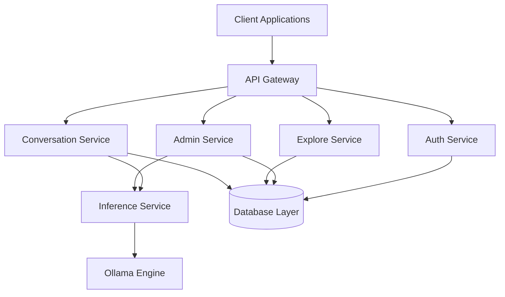

# OllamaNet Platform: Abstract

## Overview

OllamaNet is a comprehensive AI platform built on a modern microservices architecture that enables users to explore, interact with, and manage various AI models through a coherent ecosystem of services. The platform provides both administrative capabilities and end-user experiences for AI-powered conversations and model discovery, all supported by a robust database layer. By leveraging C# and .NET, OllamaNet delivers superior robustness, maintainability, and extensibility compared to traditional Python-based libraries, opening pathways for custom extensions and enterprise-grade implementations.

## Architecture

The OllamaNet platform implements a sophisticated microservices architecture with clear separation of concerns across multiple specialized services:

## Core Components

### API Gateway
Serves as the unified entry point for all client requests, handling routing, authentication, and cross-cutting concerns using Ocelot. The Gateway implements modular configuration, JWT-based authentication with role-based authorization, and claims forwarding to downstream services.

### Auth Service
Manages user authentication and authorization with comprehensive identity management functionality including user registration, login, password management, and role-based access control. Implements JWT authentication with refresh tokens for persistent sessions.

### Admin Service
Provides the administrative backbone for platform management with capabilities for user management, AI model management, tag management, and inference operations. Implements a domain-driven design with clear separation of concerns across controllers, services, and infrastructure components.

### Explore Service
Enables discovery and browsing of available AI models with functionality for retrieving paginated lists of models, detailed model information, browsing tags, and finding models associated with specific tags. Implements sophisticated Redis caching with automatic fallback to database.

### Conversation Service
Manages all aspects of user conversations with AI models, including conversation management, real-time chat with streaming responses, message history, folder organization, and note management. Implements both standard REST endpoints and streaming responses for AI model interactions.

### Inference Service
Connects to the Ollama engine for AI model inference, enabling deployment and exposure of Ollama models as public API endpoints. Implements integration with Ollama for serving local LLM models and uses ngrok for creating secure tunnels.

### Database Layer
Provides data persistence across services with a structured way to interact with the database. Implements the Repository and Unit of Work patterns to manage data operations for various entities related to AI models, conversations, user management, and more.

## Key Features

- **Microservices Architecture**: Independent, specialized services with specific domain responsibilities
- **Domain-Driven Design**: Services organized around business domains with clear separation of concerns
- **API-First Approach**: Well-defined APIs with consistent patterns across services
- **Robust Data Management**: Sophisticated data access patterns with Entity Framework Core
- **Caching Strategies**: Redis-based caching for improved performance
- **Security**: JWT authentication with role-based authorization
- **Real-time Capabilities**: Streaming responses for AI model interactions
- **Scalability**: Services can be scaled independently based on demand

## Technical Stack

- **ASP.NET Core Web API (.NET 9.0)**: Core framework for RESTful API development
- **Entity Framework Core**: ORM for data access
- **SQL Server**: Primary database for persistence
- **Redis**: Distributed caching for performance optimization
- **JWT Authentication**: Security implementation for user authentication
- **Ocelot**: API Gateway implementation
- **Ollama**: AI model inference engine
- **RabbitMQ**: Asynchronous communication between services
- **Swagger/OpenAPI**: API documentation and testing

## Architectural Principles

The OllamaNet architecture adheres to the following principles:

1. **Service Independence**: Each service can be developed, deployed, and scaled independently
2. **Domain-Driven Design**: Services are organized around business domains rather than technical functions
3. **API-First Design**: All services expose well-defined APIs with consistent patterns
4. **Resilience by Design**: The system is designed to handle failures gracefully
5. **Security at Every Layer**: Authentication and authorization are enforced consistently
6. **Scalability**: Services can be scaled independently based on demand
7. **Observability**: The system provides monitoring, logging, and diagnostics capabilities

This abstract provides a high-level overview of the OllamaNet platform, its architecture, components, and key features. The subsequent chapters delve into detailed aspects of the system design, implementation, and evaluation.