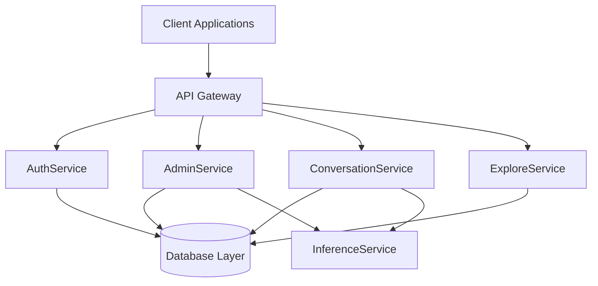

# Chapter 1: Introduction

## Project Overview

OllamaNet is a comprehensive AI platform built on a modern microservices architecture that enables users to explore, interact with, and manage various AI models through a coherent ecosystem of services. The platform provides both administrative capabilities and end-user experiences for AI-powered conversations and model discovery, all supported by a robust database layer.

The platform is designed to address the growing need for accessible, well-organized AI model interactions while maintaining security, scalability, and performance through specialized microservices that handle distinct aspects of the system's functionality.

A key purpose of OllamaNet is to provide developers with a customizable and scalable infrastructure for working with Large Language Models (LLMs), offering an alternative to existing Python-based libraries that may lack performance and customization options. By leveraging C# and .NET, the platform delivers superior robustness, maintainability, and extensibility, opening pathways for custom extensions and enterprise-grade implementations.



┌─ Terminology ──────────────────────────────────────────────────┐
│                                                                │
│ **OllamaNet**: Comprehensive AI platform with microservices    │
│ architecture for LLM interaction                               │
│                                                                │
│ **Microservice**: Independent, specialized service with        │
│ specific domain responsibilities                               │
│                                                                │
│ **LLM**: Large Language Model, an AI model used for text       │
│ generation and understanding                                   │
│                                                                │
└────────────────────────────────────────────────────────────────┘

## Problem Statement

Traditional AI model deployment and interaction platforms often face several key challenges:

1. **Complexity in Administration**: Managing AI models, users, and permissions typically requires complex administrative interfaces.
2. **Context Loss in Conversations**: Users often lose conversation history and context when interacting with AI models.
3. **Inefficient Discovery**: Finding the right AI model for specific needs can be difficult without proper categorization and search capabilities.
4. **Security Concerns**: Maintaining proper authentication and authorization across AI services presents security challenges.
5. **Performance Bottlenecks**: AI interactions can suffer from latency issues, especially without proper caching and optimization strategies.
6. **Data Management Complexity**: Handling the persistence of conversations, user data, and model information requires sophisticated data access patterns.
7. **Reliability Constraints**: Many existing solutions use non-relational databases for speed of development, sacrificing data reliability and relationship integrity in the process.
8. **Limited Customization**: Popular Python-based LLM libraries prioritize simplicity over extensibility, limiting developers' ability to customize the infrastructure.

OllamaNet addresses these challenges through its specialized microservice architecture, providing a robust, extensible, and maintainable solution for AI model interaction.

┌─ Terminology ──────────────────────────────────────────────────┐
│                                                                │
│ **API Gateway**: Component that routes requests to appropriate  │
│ microservices                                                  │
│                                                                │
│ **Context Preservation**: Maintaining conversation history      │
│ and state across interactions                                  │
│                                                                │
│ **Caching**: Storing frequently accessed data to improve       │
│ performance                                                    │
│                                                                │
└────────────────────────────────────────────────────────────────┘

## Objectives and Goals

The OllamaNet platform aims to achieve the following objectives:

1. **Provide Comprehensive Administration**: Deliver complete control over platform resources through the AdminService.
2. **Enable Secure Authentication**: Implement robust user authentication and authorization via the AuthService.
3. **Facilitate Model Discovery**: Allow users to browse and evaluate AI models through the ExploreService.
4. **Support Rich Conversations**: Enable persistent, organized conversations with AI models via the ConversationService.
5. **Ensure Data Integrity**: Maintain consistent data operations through the DB Layer.
6. **Optimize Performance**: Implement caching strategies and efficient data access patterns across services.
7. **Enhance User Experience**: Deliver a responsive, intuitive interface for all platform interactions.
8. **Enable Custom Inference**: Provide flexible AI model inference capabilities through the InferenceService.

These objectives are achieved through a carefully designed microservices architecture that emphasizes separation of concerns, domain-driven design, and robust integration patterns.

┌─ Terminology ──────────────────────────────────────────────────┐
│                                                                │
│ **Domain-Driven Design**: Software development approach that    │
│ focuses on the core domain and domain logic                    │
│                                                                │
│ **Separation of Concerns**: Design principle for separating    │
│ software into distinct sections                                │
│                                                                │
│ **Integration Pattern**: Standardized approach for connecting   │
│ different components or services                               │
│                                                                │
└────────────────────────────────────────────────────────────────┘

## Project Scope

OllamaNet encompasses a full-stack solution with the following components:

1. **Microservices Backend**:
   - **AdminService**: Central control point for platform administration, managing users, AI models, tags, and inference operations.
   - **AuthService**: Comprehensive authentication and authorization service handling user registration, login, password management, and role-based access control.
   - **ExploreService**: Model discovery and browsing service allowing users to search, filter, and explore available AI models and their capabilities.
   - **ConversationService**: Conversation management service enabling persistent, organized interactions with AI models, including real-time streaming responses.
   - **InferenceService**: Flexible inference engine service for interacting with Ollama models, exposed via ngrok for accessibility.
   - **Gateway**: API gateway service routing client requests to appropriate microservices, handling authentication and authorization.
   - **DB Layer**: Shared data access infrastructure implementing the repository and unit of work patterns for consistent data operations.

2. **Frontend Applications**:
   - Administrative interfaces for platform management
   - End-user interfaces for conversation and model exploration

3. **Infrastructure Components**:
   - SQL Server database for persistence
   - Redis for distributed caching
   - JWT-based authentication system
   - Integration with the Ollama inference engine
   - RabbitMQ for service discovery

```mermaid
graph LR
    subgraph Client Applications
        Web[Web UI]
        Mobile[Mobile Apps]
        API[External APIs]
    end
    
    subgraph OllamaNet Platform
        Gateway[API Gateway]
        subgraph Microservices
            Auth[AuthService]
            Admin[AdminService]
            Convo[ConversationService]
            Explore[ExploreService]
            Inference[InferenceService]
        end
        subgraph Data Layer
            DB[(SQL Server)]
            Cache[(Redis Cache)]
            MQ[RabbitMQ]
        end
    end
    
    Client Applications --> Gateway
    Gateway --> Microservices
    Microservices --> Data Layer
```

┌─ Terminology ──────────────────────────────────────────────────┐
│                                                                │
│ **Repository Pattern**: Design pattern that mediates between    │
│ the domain and data mapping layers                             │
│                                                                │
│ **Unit of Work**: Pattern that maintains a list of objects     │
│ affected by a business transaction                             │
│                                                                │
│ **JWT**: JSON Web Token, a secure method for representing       │
│ claims between parties                                         │
│                                                                │
│ **Redis**: In-memory data structure store used for caching     │
│                                                                │
│ **RabbitMQ**: Message broker software for service-to-service   │
│ communication                                                  │
│                                                                │
└────────────────────────────────────────────────────────────────┘

## Implementation Strategy

OllamaNet follows a structured implementation approach:

1. **Service Isolation**: Each microservice addresses a specific domain with clear boundaries, following domain-driven design principles.
2. **Shared Data Layer**: A common DB layer provides consistent data access patterns across all services.
3. **API-First Design**: RESTful APIs with comprehensive documentation via Swagger/OpenAPI ensure clear service interfaces.
4. **Progressive Enhancement**: Services evolve through phased migrations and improvements, with clear versioning.
5. **Performance Optimization**: Strategic caching and efficient data access patterns ensure responsive user experiences.
6. **Security Integration**: Consistent authentication and authorization across services protect resources.
7. **Domain-Driven Design**: Service organization based on business domains and use cases ensures alignment with business needs.
8. **Notebook-First Inference**: The InferenceService uses a notebook-based architecture for flexibility and accessibility.

This implementation strategy enables the platform to be both robust and flexible, catering to enterprise-grade requirements while maintaining developer accessibility and extensibility.

┌─ Terminology ──────────────────────────────────────────────────┐
│                                                                │
│ **REST**: Representational State Transfer, an architectural     │
│ style for designing networked applications                     │
│                                                                │
│ **Swagger/OpenAPI**: Framework for API documentation and        │
│ specification                                                  │
│                                                                │
│ **Notebook-First Architecture**: Implementation approach that   │
│ prioritizes interactive development environments               │
│                                                                │
└────────────────────────────────────────────────────────────────┘

## Report Structure

This documentation is organized to provide a comprehensive understanding of the OllamaNet platform:

- **Chapter 2**: Explores the background and theoretical foundations of microservices architecture
- **Chapter 3**: Details the requirements analysis and domain modeling
- **Chapter 4**: Describes the overall system architecture and communication patterns
- **Chapter 5**: Examines the database layer and data management strategies
- **Chapter 6**: Provides detailed designs for each microservice
- **Chapter 7**: Outlines the frontend architecture and integration
- **Chapter 8**: Explains the testing strategy across services
- **Chapter 9**: Covers implementation details and development practices
- **Chapter 10**: Presents system evaluation and performance metrics
- **Chapter 11**: Concludes with lessons learned and future directions

Each chapter builds on the previous to create a complete picture of the OllamaNet platform's architecture, implementation, and value proposition.

┌─ Terminology ──────────────────────────────────────────────────┐
│                                                                │
│ **Architecture**: The high-level structure of a software       │
│ system                                                         │
│                                                                │
│ **Domain Model**: Conceptual model of the domain that          │
│ incorporates both behavior and data                            │
│                                                                │
│ **Communication Pattern**: Standard approach for service       │
│ interactions in a distributed system                           │
│                                                                │
└────────────────────────────────────────────────────────────────┘ 