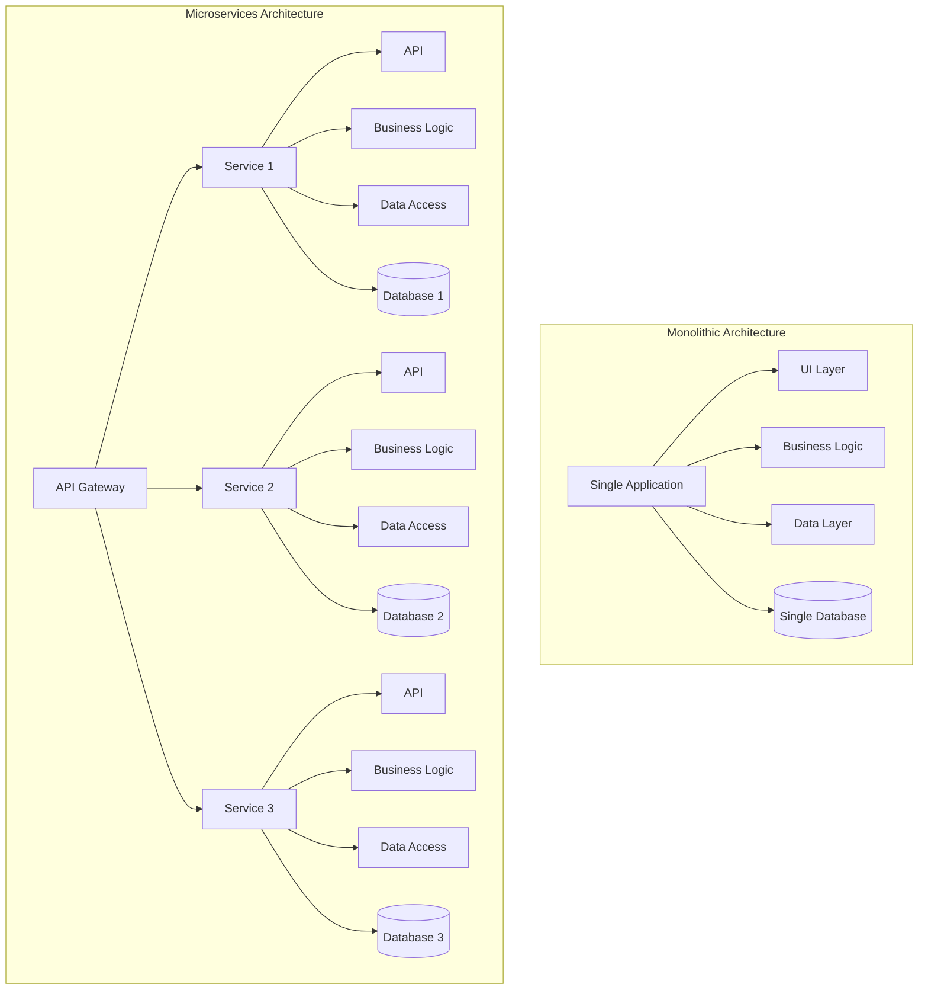
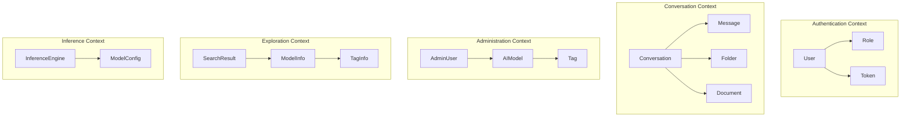
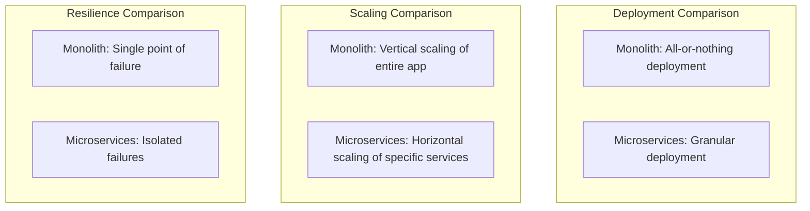
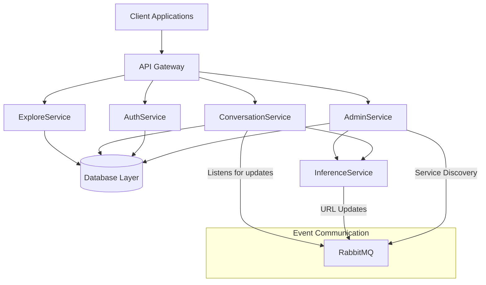
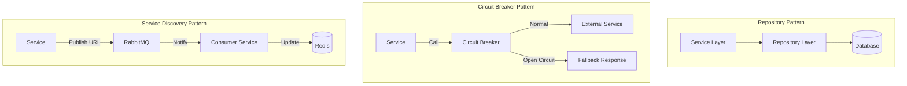

# Chapter 2: Background & Literature Review

## Theoretical Background

The OllamaNet platform is built on several key theoretical foundations that inform its architecture and design:

### Microservices Architecture

Microservices architecture represents a modern approach to software development where applications are composed of small, independent services that communicate over well-defined APIs. This architectural style has gained prominence as an alternative to monolithic applications, offering benefits such as:

- **Independent Deployability**: Each service can be deployed, upgraded, and scaled independently
- **Technology Diversity**: Different services can use different technologies based on their specific requirements
- **Focused Development Teams**: Teams can focus on specific business domains and services
- **Resilience**: Failures in one service can be isolated without affecting the entire system
- **Scalability**: Services can be individually scaled based on demand

For OllamaNet, microservices architecture enables the separation of concerns between different aspects of the platform (authentication, administration, conversations, exploration, inference) while allowing for independent evolution of each component.

┌─ Terminology ──────────────────────────────────────────────────┐
│                                                                │
│ **Microservice**: An architectural style that structures an    │
│ application as a collection of services that are independently │
│ deployable                                                     │
│                                                                │
│ **API Gateway**: A server that acts as an API front-end,       │
│ receiving API requests and routing them to appropriate services│
│                                                                │
└────────────────────────────────────────────────────────────────┘

### Domain-Driven Design

Domain-Driven Design (DDD) is a software development approach that focuses on modeling the software to match the business domain. It involves:

- **Ubiquitous Language**: A common language shared between developers and domain experts
- **Bounded Contexts**: Explicit boundaries between different domain models
- **Entities and Value Objects**: Clear modeling of domain objects based on identity and characteristics
- **Aggregates**: Clusters of domain objects treated as a unit for data changes
- **Domain Services**: Operations that don't naturally belong to any specific entity

OllamaNet employs DDD principles to ensure each microservice accurately represents its domain model (administration, authentication, conversations, exploration, inference) with appropriate boundaries and clear separation of concerns. This approach resulted in well-defined service boundaries that align with business capabilities.

┌─ Terminology ──────────────────────────────────────────────────┐
│                                                                │
│ **Bounded Context**: A conceptual boundary within which a      │
│ particular domain model applies                               │
│                                                                │
│ **Aggregate**: A cluster of domain objects that can be         │
│ treated as a single unit                                       │
│                                                                │
│ **Ubiquitous Language**: A common language used by developers  │
│ and domain experts to describe domain concepts                 │
│                                                                │
└────────────────────────────────────────────────────────────────┘

### API Design and RESTful Principles

The OllamaNet platform follows RESTful API design principles across all its services:

- **Resource-Oriented**: APIs are designed around resources (conversations, models, users)
- **Standard HTTP Verbs**: GET, POST, PUT, DELETE are used for CRUD operations
- **Stateless Communication**: Each request contains all necessary information
- **Standardized Response Formats**: Consistent JSON responses with appropriate HTTP status codes
- **Versioning**: API versioning to support evolution without breaking changes
- **Clear Endpoint Naming**: Intuitive and descriptive endpoint paths

These principles ensure consistency across services and ease of integration for client applications.

### Authentication and Authorization Theories

OllamaNet implements a robust authentication and authorization system using established security patterns:

- **Token-Based Authentication**: Using JWT (JSON Web Tokens) for secure, stateless authentication
- **Claims-Based Identity**: User information stored as claims within tokens
- **Role-Based Access Control**: Permissions assigned based on user roles
- **Refresh Token Pattern**: Long-lived refresh tokens used to obtain new access tokens
- **Token Validation**: Comprehensive validation of token signature, expiry, and claims
- **Gateway Authentication**: Centralized authentication at the API Gateway level

### Caching Strategies and Patterns

The platform implements several caching strategies to optimize performance:

- **Distributed Caching**: Redis used as a shared cache across services
- **Cache-Aside Pattern**: Data retrieved from cache first, falling back to the database
- **Expiration Policies**: Time-based expiration tailored to data volatility
- **Cache Invalidation**: Strategies to update or invalidate cached data when modified
- **Multi-Level Caching**: In-memory and distributed caching used in tandem
- **Resilient Caching**: Graceful fallback when cache is unavailable

### Distributed Systems Concepts

As a distributed system, OllamaNet addresses several core distributed computing challenges:

- **Service Discovery**: Using message brokers (RabbitMQ) for dynamic service URL updates
- **Consistency Models**: Ensuring data consistency across services
- **Failure Handling**: Strategies for graceful degradation when components fail
- **Distributed Tracing**: Request tracing across service boundaries
- **Eventual Consistency**: Accepting temporary inconsistency for system availability
- **Circuit Breaking**: Preventing cascading failures across service calls

┌─ Terminology ──────────────────────────────────────────────────┐
│                                                                │
│ **REST**: Representational State Transfer, an architectural    │
│ style for distributed hypermedia systems                       │
│                                                                │
│ **JWT**: JSON Web Token, a compact, URL-safe means of          │
│ representing claims to be transferred between two parties      │
│                                                                │
│ **Caching**: Storing copies of data in a high-speed data       │
│ store to reduce database load                                  │
│                                                                │
└────────────────────────────────────────────────────────────────┘

## Similar Systems Analysis

Several existing AI platforms offer similar functionality to OllamaNet, though often with different architectural approaches:

### OpenAI API Platform

- **Architecture**: Centralized API services with limited customization
- **Strengths**: Enterprise-grade security, high-reliability, extensive model selection
- **Limitations**: Limited local deployment options, proprietary technology stack, higher cost
- **Comparison**: OllamaNet provides greater customization, local deployment, and cost advantages

### Hugging Face Spaces

- **Architecture**: Model hosting platform with standardized deployment
- **Strengths**: Wide model availability, community-driven, integrated UI components
- **Limitations**: Less focus on enterprise features, limited conversation persistence
- **Comparison**: OllamaNet offers stronger administrative controls and conversation management

### LangChain

- **Architecture**: Python framework for LLM development, not a complete platform
- **Strengths**: Extensive integrations, component-based architecture, rapid prototyping
- **Limitations**: Python-centric, less focus on enterprise deployment, limited built-in UI
- **Comparison**: OllamaNet provides a complete, production-ready system vs. a development framework

### LocalAI

- **Architecture**: Local API server for open-source models
- **Strengths**: Self-hosted, privacy-focused, open-source
- **Limitations**: Limited administrative features, Python-based implementation
- **Comparison**: OllamaNet offers more comprehensive microservices with better separation of concerns

### Ollama (Base System)

- **Architecture**: Single-service model server
- **Strengths**: Easy setup, rapidly growing ecosystem, excellent command-line interface
- **Limitations**: Limited administrative features, basic conversation management
- **Comparison**: OllamaNet extends Ollama's capabilities with robust microservices around it

A key advantage of OllamaNet over these systems is its comprehensive microservices approach with strong domain separation, robust database structure, and enterprise-grade features while maintaining the ability to leverage open-source models.

## Technologies Evaluation

The OllamaNet platform has been built using a carefully selected technology stack:

### Backend Framework

**ASP.NET Core (.NET 9.0)** was chosen as the primary backend framework for all microservices due to:
- Performance advantages and scalability
- Comprehensive support for RESTful API development
- Strong typing and compile-time safety
- Rich ecosystem of libraries and tools
- Cross-platform capabilities
- Superior robustness compared to popular Python-based LLM libraries
- Enhanced customizability and extensibility for enterprise implementations
- Better thread management for handling concurrent LLM operations

The decision to use C# and .NET over Python (the most common language for LLM applications) was deliberate, prioritizing long-term maintainability, performance, and enterprise-grade stability over the rapid prototyping advantages of Python libraries. This choice enables developers to build custom extensions and integrations with greater confidence in the system's reliability and scalability.

### Database Technologies

**SQL Server** serves as the primary database technology, offering:
- Strong ACID compliance for transactional integrity
- Robust performance for relational data
- Comprehensive tooling and management capabilities
- Strong integration with Entity Framework Core
- Superior data reliability compared to non-relational alternatives

OllamaNet deliberately employs a relational database schema rather than trending non-relational approaches. While non-relational databases offer faster development cycles and simpler initial setup, the project prioritizes data reliability, relationship integrity, and consistent query performance. This approach ensures conversations, user data, and model information maintain their referential integrity and can be reliably retrieved with consistent performance characteristics, even as the data grows in complexity and volume.

**Redis** provides distributed caching capabilities, delivering:
- High-performance in-memory data storage
- Support for various data structures
- Pub/Sub capabilities for real-time features
- Distributed caching across services

### Authentication & Authorization

**JWT (JSON Web Tokens)** with refresh token functionality was implemented for:
- Stateless authentication between services
- Secure transmission of claims
- Support for token expiration and renewal
- Cross-service authorization

### API Documentation

**Swagger/OpenAPI** was selected for API documentation because it offers:
- Interactive API exploration and testing
- Automatic documentation generation
- Client code generation capabilities
- Standardized API specifications

### ORM Solution

**Entity Framework Core** serves as the object-relational mapping solution, providing:
- Clean abstraction over database operations
- LINQ support for type-safe queries
- Migrations for database schema evolution
- Comprehensive relationship mapping

### Additional Libraries and Tools

- **FluentValidation**: Comprehensive request validation
- **Polly**: Resilience policies for external service calls
- **OllamaSharp**: Client library for Ollama API integration
- **StackExchange.Redis**: Redis client for distributed caching
- **RabbitMQ Client**: Message broker integration for service discovery
- **Jupyter Notebook** (for InferenceService): Interactive development environment
- **ngrok** (for InferenceService): Secure tunneling for notebook-based services

┌─ Terminology ──────────────────────────────────────────────────┐
│                                                                │
│ **ORM**: Object-Relational Mapping, a technique for converting │
│ data between incompatible type systems                         │
│                                                                │
│ **ACID**: Atomicity, Consistency, Isolation, Durability -      │
│ properties of database transactions that guarantee validity     │
│                                                                │
│ **Pub/Sub**: Publish/Subscribe pattern where senders don't     │
│ send messages directly to receivers                            │
│                                                                │
└────────────────────────────────────────────────────────────────┘

## Architectural Patterns

### Monolithic vs Microservices Comparison

OllamaNet chose a microservices architecture over a monolithic approach after careful consideration of trade-offs:

| Aspect | Monolithic Approach | Microservices Approach | OllamaNet Decision |
|--------|---------------------|------------------------|-------------------|
| Deployment | Simple but all-or-nothing | Complex but granular | Microservices for deployment flexibility |
| Development | Simple coordination but coupled | Independent but requires interfaces | Microservices for team autonomy |
| Scaling | Vertical scaling of entire application | Horizontal scaling of specific services | Microservices for targeted scaling |
| Technology | Single technology stack | Technology diversity | Microservices with consistent .NET stack |
| Resilience | Single point of failure | Isolated failures | Microservices for fault isolation |
| Complexity | Lower initial complexity | Higher distributed complexity | Microservices with careful boundary design |

### Microservices Architecture Overview

OllamaNet implements a microservices architecture with the following characteristics:

- **Service Boundaries**: Services are divided along clear domain boundaries (administration, authentication, conversations, exploration, inference)
- **API Gateway Pattern**: Gateway service provides a single entry point for clients
- **Shared Data Layer**: Common DB layer for consistent data access patterns across services
- **Event-Driven Communication**: Services communicate through events for loose coupling
- **Distributed Caching**: Redis-based caching for performance optimization
- **Authentication Integration**: JWT-based authentication shared across services
- **Service Discovery**: Dynamic discovery of service endpoints, especially critical for the notebook-based InferenceService

### Design Patterns in Microservices

OllamaNet implements several design patterns to solve common challenges in microservices architecture:

- **Repository Pattern**: Abstracts data access logic from business logic across all services
- **Unit of Work Pattern**: Coordinates operations across multiple repositories
- **Mediator Pattern**: Decouples request handling from business logic
- **Circuit Breaker Pattern**: Prevents cascading failures across services
- **Retry Pattern**: Automatic retry with exponential backoff for transient failures
- **API Gateway Pattern**: Service-specific APIs with consistent patterns
- **Service Discovery Pattern**: Dynamic discovery of service endpoints via RabbitMQ
- **Caching Strategy Pattern**: Multi-level caching for performance optimization
- **Configuration Management Pattern**: Centralized configuration with dynamic updates
- **Decorator Pattern**: Authentication and authorization implemented as decorators
- **Strategy Pattern**: Different services have different routing strategies

A unique aspect of OllamaNet's design is the notebook-first architecture of the InferenceService, which combines Python flexibility with the robustness of .NET microservices. This service uses ngrok tunneling and RabbitMQ-based service discovery to expose Ollama LLM capabilities from any cloud notebook environment, while maintaining secure integration with the broader platform.

┌─ Terminology ──────────────────────────────────────────────────┐
│                                                                │
│ **Repository Pattern**: A design pattern that mediates between │
│ the domain and data mapping layers                             │
│                                                                │
│ **Unit of Work**: A pattern that maintains a list of objects   │
│ affected by a business transaction                             │
│                                                                │
│ **Circuit Breaker**: A design pattern that detects failures    │
│ and prevents further requests to failing components            │
│                                                                │
└────────────────────────────────────────────────────────────────┘ 