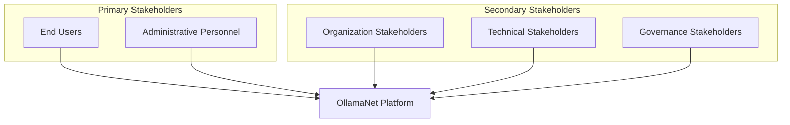
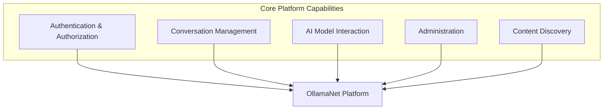
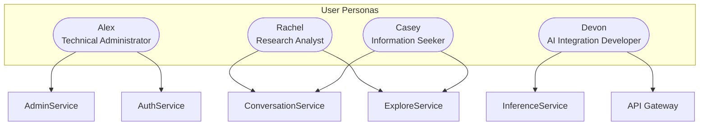
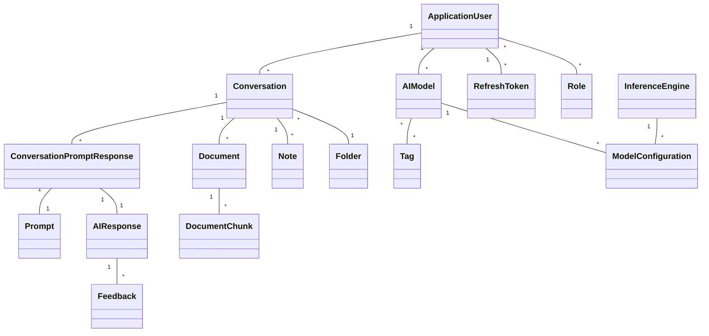
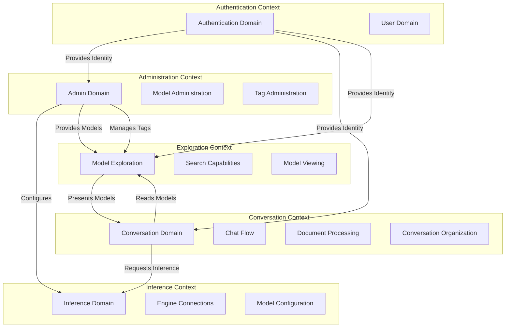

# Chapter 3: Requirements Analysis

## Stakeholder Analysis

### Identification of Key Stakeholders

The OllamaNet platform serves a diverse group of stakeholders with varying needs and interests:

1. **End Users**
   - Regular users seeking AI-powered conversations
   - Knowledge workers and researchers
   - Content creators and developers
   - Students and educators

2. **Administrative Personnel**
   - Platform administrators
   - System operators
   - Security administrators
   - DevOps engineers

3. **Organization Stakeholders**
   - IT departments
   - Management teams
   - Security and compliance teams
   - Model development teams

4. **Technical Stakeholders**
   - Frontend application developers
   - Integration partners
   - API consumers
   - Infrastructure providers

5. **Governance Stakeholders**
   - Data privacy officers
   - Compliance managers
   - Legal representatives
   - Information security officers

### Stakeholder Needs and Concerns

#### End User Needs
- Intuitive and responsive user interface
- Persistent conversation history
- Well-organized conversation management
- Fast and accurate AI responses
- Data privacy and security
- Seamless authentication
- Consistent experience across sessions
- Search capabilities for past interactions
- Access to a variety of AI models

#### Administrative Personnel Needs
- Comprehensive user management capabilities
- Fine-grained access control
- System monitoring and analytics
- Model deployment and management tools
- Platform configuration controls
- Efficient troubleshooting capabilities
- Audit and compliance features
- Task automation

#### Organization Stakeholders' Concerns
- Total cost of ownership
- Compliance with organizational policies
- Data security and privacy
- User productivity and efficiency
- Integration with existing systems
- Customization capabilities
- Governance and oversight

#### Technical Stakeholders' Needs
- Well-documented APIs
- Reliable service availability
- Consistent data models
- Proper error handling
- Scalable architecture
- Performance optimization
- Testability and debugging support

#### Governance Stakeholders' Concerns
- Regulatory compliance (GDPR, CCPA, etc.)
- Data residency requirements
- Audit trails and reporting
- Security controls and monitoring
- Risk management
- Intellectual property protection

### Priority Matrix of Stakeholder Requirements

The following matrix presents the relative priority of key requirements across different stakeholder groups, rated as High (H), Medium (M), or Low (L) priority:

| Requirement | End Users | Admins | Organization | Technical | Governance |
|-------------|-----------|--------|--------------|-----------|------------|
| Conversation Persistence | H | L | M | L | M |
| Model Discovery | H | M | M | L | L |
| User Authentication | M | H | H | M | H |
| Admin Controls | L | H | H | L | M |
| Performance | H | M | M | H | L |
| Security | M | H | H | M | H |
| API Access | L | M | L | H | L |
| Data Management | M | H | M | M | H |
| Scalability | L | H | H | H | L |
| Compliance | L | M | H | L | H |

### Conflicting Requirements and Resolution Approach

Several areas of potential conflict have been identified between different stakeholders' requirements:

1. **Performance vs. Security**
   - **Conflict**: End users prioritize fast response times, while security stakeholders require thorough validation and protection measures that may introduce latency.
   - **Resolution**: Implement performance-optimized security measures, such as caching JWT validation results, using distributed authentication, and implementing parallel processing where possible.

2. **Usability vs. Compliance**
   - **Conflict**: Seamless user experience may conflict with compliance requirements for explicit consents and disclosures.
   - **Resolution**: Design user-friendly compliance features that integrate organically into the workflow, such as progressive disclosure of terms and just-in-time consent mechanisms.

3. **Flexibility vs. Governance**
   - **Conflict**: Technical stakeholders want maximum flexibility and customization, while governance stakeholders require standardization and controlled processes.
   - **Resolution**: Implement a modular architecture with clear extension points, coupled with governance policies on which aspects can be customized and how changes are managed.

4. **Notebook-First Architecture vs. Reliability**
   - **Conflict**: The InferenceService's notebook-first architecture provides flexibility but creates challenges for reliability and management.
   - **Resolution**: Implement robust service discovery mechanisms, monitoring, and auto-recovery while preserving the flexibility of the notebook environment.

5. **Centralized vs. Distributed Data**
   - **Conflict**: Performance and user experience benefit from distributed caching, while governance and management prefer centralized control.
   - **Resolution**: Implement a hybrid approach with a primary centralized database of record and distributed caching with clear invalidation strategies.

┌─ Terminology ──────────────────────────────────────────────────┐
│                                                                │
│ **Stakeholder**: Any person, group, or organization with an    │
│ interest in or concern about the project                       │
│                                                                │
│ **Requirements Priority Matrix**: A visualization showing the  │
│ relative importance of requirements to different stakeholders  │
│                                                                │
└────────────────────────────────────────────────────────────────┘

## Functional Requirements

### Core Platform Capabilities

The OllamaNet platform must provide the following core capabilities:

1. **User Authentication and Authorization**
   - The system shall provide secure user registration and login facilities
   - The system shall support role-based access control
   - The system shall implement JWT-based authentication with refresh token support
   - The system shall enforce appropriate authorization checks across all services

2. **Conversation Management**
   - The system shall enable creation, retrieval, update, and deletion of conversations
   - The system shall maintain conversation history persistently
   - The system shall support organizing conversations in folders
   - The system shall provide search functionality for past conversations
   - The system shall enable real-time streaming of AI responses

3. **AI Model Interaction**
   - The system shall connect to the Ollama inference engine
   - The system shall support multiple AI models
   - The system shall maintain context during conversation
   - The system shall provide streaming responses for real-time interaction
   - The system shall support document-based context enhancement

4. **Administration and Governance**
   - The system shall provide tools for user management
   - The system shall enable AI model configuration and deployment
   - The system shall support categorization through a tagging system
   - The system shall maintain audit logs for administrative actions
   - The system shall provide monitoring capabilities

5. **Content Discovery**
   - The system shall enable browsing and searching for AI models
   - The system shall provide detailed model information
   - The system shall support filtering models by tags and categories
   - The system shall optimize discovery through caching

### Service-Specific Functionality Requirements

#### AuthService Requirements

1. **User Account Management**
   - FR-AUTH-01: The service shall allow registration of new users with email, password, and basic profile information
   - FR-AUTH-02: The service shall validate email addresses through confirmation mechanisms
   - FR-AUTH-03: The service shall support password reset functionality
   - FR-AUTH-04: The service shall enforce password complexity requirements

2. **Authentication Mechanisms**
   - FR-AUTH-05: The service shall authenticate users via username/email and password
   - FR-AUTH-06: The service shall issue JWT tokens upon successful authentication
   - FR-AUTH-07: The service shall support refresh tokens for maintaining sessions
   - FR-AUTH-08: The service shall implement token revocation for security purposes

3. **Authorization Management**
   - FR-AUTH-09: The service shall support role assignment to users
   - FR-AUTH-10: The service shall provide APIs for role management
   - FR-AUTH-11: The service shall enforce role-based access control
   - FR-AUTH-12: The service shall validate tokens and claims for all protected endpoints

#### AdminService Requirements

1. **User Administration**
   - FR-ADMIN-01: The service shall provide CRUD operations for user management
   - FR-ADMIN-02: The service shall support role assignment and revocation
   - FR-ADMIN-03: The service shall enable account status management (activation/deactivation)
   - FR-ADMIN-04: The service shall support bulk operations for administrative efficiency

2. **Model Administration**
   - FR-ADMIN-05: The service shall enable registration of AI models with metadata
   - FR-ADMIN-06: The service shall provide model update and deletion capabilities
   - FR-ADMIN-07: The service shall support model categorization through tags
   - FR-ADMIN-08: The service shall allow model activation and deactivation

3. **Tag Management**
   - FR-ADMIN-09: The service shall provide CRUD operations for tags
   - FR-ADMIN-10: The service shall enable association of tags with models
   - FR-ADMIN-11: The service shall support hierarchical tag relationships
   - FR-ADMIN-12: The service shall provide search and filtering for tags

4. **Model Deployment**
   - FR-ADMIN-13: The service shall connect to the Ollama API for model operations
   - FR-ADMIN-14: The service shall support model installation with progress tracking
   - FR-ADMIN-15: The service shall provide model information retrieval
   - FR-ADMIN-16: The service shall enable model removal and cleanup

#### ConversationService Requirements

1. **Conversation Management**
   - FR-CONV-01: The service shall provide CRUD operations for conversations
   - FR-CONV-02: The service shall support conversation title management
   - FR-CONV-03: The service shall enable conversation search and filtering
   - FR-CONV-04: The service shall manage conversation archiving and deletion

2. **Chat Functionality**
   - FR-CONV-05: The service shall enable sending messages to AI models
   - FR-CONV-06: The service shall support streaming responses for real-time interaction
   - FR-CONV-07: The service shall maintain conversation context for improved responses
   - FR-CONV-08: The service shall track and report token usage

3. **Organization Features**
   - FR-CONV-09: The service shall provide folder CRUD operations
   - FR-CONV-10: The service shall support moving conversations between folders
   - FR-CONV-11: The service shall enable note-taking associated with conversations
   - FR-CONV-12: The service shall support tagging and categorization of conversations

4. **Document Integration**
   - FR-CONV-13: The service shall enable document uploading and management
   - FR-CONV-14: The service shall process documents for content extraction
   - FR-CONV-15: The service shall use document content for context enhancement
   - FR-CONV-16: The service shall support multiple document formats (PDF, TXT, DOCX)

5. **Feedback Collection**
   - FR-CONV-17: The service shall provide mechanisms for users to rate AI responses
   - FR-CONV-18: The service shall collect optional feedback comments
   - FR-CONV-19: The service shall store feedback for future analysis
   - FR-CONV-20: The service shall associate feedback with specific AI responses

#### ExploreService Requirements

1. **Model Discovery**
   - FR-EXPL-01: The service shall provide a catalog of available AI models
   - FR-EXPL-02: The service shall support browsing models by categories
   - FR-EXPL-03: The service shall enable searching for models by keywords
   - FR-EXPL-04: The service shall support filtering models by various attributes

2. **Model Information**
   - FR-EXPL-05: The service shall provide detailed model metadata
   - FR-EXPL-06: The service shall display model capabilities and specifications
   - FR-EXPL-07: The service shall show associated tags and categories
   - FR-EXPL-08: The service shall include model usage information when available

3. **Performance Optimization**
   - FR-EXPL-09: The service shall implement caching for frequently accessed model data
   - FR-EXPL-10: The service shall optimize search operations for performance
   - FR-EXPL-11: The service shall use pagination for large result sets
   - FR-EXPL-12: The service shall implement cache invalidation strategies

#### InferenceService Requirements

1. **Model Inference**
   - FR-INF-01: The service shall provide API endpoints for AI model inference
   - FR-INF-02: The service shall support text completion requests
   - FR-INF-03: The service shall enable streaming responses
   - FR-INF-04: The service shall maintain connection with the Ollama backend

2. **Service Discovery**
   - FR-INF-05: The service shall dynamically publish its endpoint URL
   - FR-INF-06: The service shall use RabbitMQ for service discovery messages
   - FR-INF-07: The service shall implement secure tunneling via ngrok
   - FR-INF-08: The service shall provide health check endpoints

3. **Notebook Integration**
   - FR-INF-09: The service shall operate in cloud notebook environments
   - FR-INF-10: The service shall handle environment initialization
   - FR-INF-11: The service shall manage Ollama and ngrok processes
   - FR-INF-12: The service shall provide interactive operation controls

### API Requirements

The OllamaNet platform's APIs must adhere to the following requirements:

1. **REST Principles**
   - The APIs shall follow RESTful design practices
   - The APIs shall use standard HTTP verbs appropriately (GET, POST, PUT, DELETE)
   - The APIs shall return appropriate HTTP status codes
   - The APIs shall implement proper resource naming conventions

2. **API Documentation**
   - All APIs shall be documented using Swagger/OpenAPI
   - API documentation shall include endpoint descriptions, parameters, and response formats
   - API documentation shall be available through interactive endpoints
   - API documentation shall include example requests and responses

3. **Request/Response Format**
   - APIs shall accept and return data in JSON format
   - APIs shall implement consistent request validation
   - APIs shall provide clear error messages and codes
   - APIs shall use pagination for large result sets

4. **Security Controls**
   - APIs shall require authentication for protected resources
   - APIs shall validate JWT tokens for protected endpoints
   - APIs shall implement appropriate CORS policies
   - APIs shall sanitize inputs to prevent injection attacks

5. **Versioning**
   - APIs shall support versioning to maintain backward compatibility
   - API versions shall be included in the URL path
   - API changes shall be documented between versions
   - Deprecated API versions shall be clearly marked

### Integration Requirements

The OllamaNet platform requires the following integration capabilities:

1. **Service-to-Service Communication**
   - Services shall communicate via well-defined APIs
   - Services shall handle communication errors gracefully
   - Services shall implement circuit breakers for resilience
   - Services shall validate data received from other services

2. **External System Integration**
   - The platform shall integrate with Ollama for model inference
   - The platform shall support ngrok for dynamic service exposure
   - The platform shall implement RabbitMQ for messaging and service discovery
   - The platform shall provide extensibility points for future integrations

3. **Frontend Integration**
   - The platform shall provide APIs suitable for frontend consumption
   - The platform shall implement appropriate CORS settings
   - The platform shall support real-time features through streaming APIs
   - The platform shall implement API rate limiting for fairness

4. **Data Synchronization**
   - The platform shall maintain data consistency across services
   - The platform shall implement appropriate caching strategies
   - The platform shall handle concurrent modifications appropriately
   - The platform shall provide mechanisms for data reconciliation

### Security and Access Control Requirements

1. **Authentication**
   - The platform shall implement JWT-based authentication
   - The platform shall support refresh tokens for session maintenance
   - The platform shall enforce token expiration and validation
   - The platform shall provide secure password management

2. **Authorization**
   - The platform shall implement role-based access control
   - The platform shall enforce authorization at the API Gateway level
   - The platform shall propagate user claims to downstream services
   - The platform shall validate permissions for protected operations

3. **Data Protection**
   - The platform shall encrypt sensitive data at rest
   - The platform shall use HTTPS for all communications
   - The platform shall implement proper data isolation between users
   - The platform shall provide secure credential storage

4. **Audit and Compliance**
   - The platform shall maintain audit logs for security events
   - The platform shall log authentication attempts and failures
   - The platform shall track administrative actions
   - The platform shall support compliance reporting

### Data Management Requirements

1. **Data Storage**
   - The platform shall use SQL Server for relational data storage
   - The platform shall implement proper schema design
   - The platform shall maintain referential integrity
   - The platform shall support data migration and evolution

2. **Data Access**
   - The platform shall implement the repository pattern for data access
   - The platform shall use the unit of work pattern for transaction management
   - The platform shall provide efficient query capabilities
   - The platform shall support pagination for large data sets

3. **Caching**
   - The platform shall implement Redis for distributed caching
   - The platform shall use appropriate cache expiration policies
   - The platform shall maintain cache consistency
   - The platform shall provide fallback mechanisms for cache failures

4. **Data Lifecycle**
   - The platform shall support soft deletion for most entities
   - The platform shall implement data archiving strategies
   - The platform shall provide data export capabilities
   - The platform shall handle data purging for compliance

┌─ Terminology ──────────────────────────────────────────────────┐
│                                                                │
│ **Functional Requirement**: A requirement that specifies what  │
│ the system should do                                           │
│                                                                │
│ **Service Capability**: A discrete function or set of          │
│ functions provided by a service                                │
│                                                                │
└────────────────────────────────────────────────────────────────┘

## Non-Functional Requirements

### Performance Requirements

The OllamaNet platform must meet the following performance requirements:

1. **Response Time**
   - NFR-PERF-01: API endpoints shall respond within 200ms for non-computational operations
   - NFR-PERF-02: Authentication operations shall complete within 500ms
   - NFR-PERF-03: Database queries shall execute within 100ms for 95% of requests
   - NFR-PERF-04: Static resource delivery shall occur within 50ms
   - NFR-PERF-05: AI inference first-token response shall occur within 1 second

2. **Throughput**
   - NFR-PERF-06: The platform shall support at least 100 concurrent users per instance
   - NFR-PERF-07: The platform shall process at least 50 API requests per second per instance
   - NFR-PERF-08: The platform shall manage at least 25 concurrent conversation sessions per instance
   - NFR-PERF-09: The administrative API shall handle at least 20 requests per second
   - NFR-PERF-10: Each service shall be capable of horizontal scaling to increase throughput

3. **Caching Performance**
   - NFR-PERF-11: Redis cache access shall complete within 10ms
   - NFR-PERF-12: Cache hit ratio shall exceed 80% for frequently accessed data
   - NFR-PERF-13: JWT validation cache shall maintain a hit ratio above 90%
   - NFR-PERF-14: Cache invalidation shall propagate within 5 seconds
   - NFR-PERF-15: Cache warm-up shall complete within 30 seconds of service start

4. **Resource Utilization**
   - NFR-PERF-16: Services shall utilize less than 70% CPU under normal load
   - NFR-PERF-17: Memory consumption shall not exceed 2GB per service instance
   - NFR-PERF-18: Database connections shall be pooled with a maximum of 100 connections
   - NFR-PERF-19: Network bandwidth usage shall remain below 50Mbps under normal operations
   - NFR-PERF-20: Disk I/O shall remain below 70% utilization

### Scalability Requirements

The OllamaNet platform must satisfy the following scalability requirements:

1. **Horizontal Scaling**
   - NFR-SCAL-01: All services shall support horizontal scaling through multiple instances
   - NFR-SCAL-02: The platform shall support auto-scaling based on predefined metrics
   - NFR-SCAL-03: Service instances shall be stateless to facilitate scaling
   - NFR-SCAL-04: The platform shall maintain performance under load with linear resource addition
   - NFR-SCAL-05: Node addition shall not require system restart

2. **Database Scalability**
   - NFR-SCAL-06: The database shall support partitioning for data growth
   - NFR-SCAL-07: The system shall support read replicas for query scaling
   - NFR-SCAL-08: Database operations shall use appropriate indexing for scale
   - NFR-SCAL-09: The platform shall implement database connection pooling
   - NFR-SCAL-10: Query patterns shall be optimized for large data volumes

3. **Caching Scalability**
   - NFR-SCAL-11: Redis cache shall support cluster mode for horizontal scaling
   - NFR-SCAL-12: Cache size shall be configurable based on deployment environment
   - NFR-SCAL-13: The platform shall implement multiple cache levels for scalability
   - NFR-SCAL-14: Cache eviction policies shall optimize for memory utilization
   - NFR-SCAL-15: The platform shall gracefully handle cache server failures

4. **Load Handling**
   - NFR-SCAL-16: The platform shall implement rate limiting to prevent overload
   - NFR-SCAL-17: The platform shall queue excess requests rather than reject them
   - NFR-SCAL-18: The platform shall degrade gracefully under extreme load
   - NFR-SCAL-19: Backend services shall implement backpressure mechanisms
   - NFR-SCAL-20: The platform shall support traffic prioritization

```mermaid
graph TD
    subgraph "OllamaNet Scalability"
        HScaling[Horizontal Scaling]
        DBScaling[Database Scalability]
        CacheScaling[Cache Scalability]
        LoadHandling[Load Handling]
    end
    
    HScaling --> AutoScale[Auto-Scaling]
    HScaling --> Stateless[Stateless Services]
    HScaling --> LinearPerf[Linear Performance]
    
    DBScaling --> Partitioning[Partitioning]
    DBScaling --> ReadReplicas[Read Replicas]
    DBScaling --> Indexing[Query Optimization]
    
    CacheScaling --> RedisCluster[Redis Clustering]
    CacheScaling --> MultilevelCache[Multilevel Caching]
    CacheScaling --> FailoverCache[Cache Failover]
    
    LoadHandling --> RateLimiting[API Rate Limiting]
    LoadHandling --> Queueing[Request Queueing]
    LoadHandling --> GracefulDegradation[Graceful Degradation]
```

### Security Requirements

The OllamaNet platform must comply with the following security requirements:

1. **Authentication and Authorization**
   - NFR-SEC-01: User passwords shall be stored using industry-standard hashing algorithms (bcrypt)
   - NFR-SEC-02: JWT tokens shall expire after 15 minutes of inactivity
   - NFR-SEC-03: Refresh tokens shall expire after 30 days
   - NFR-SEC-04: Failed login attempts shall be limited to prevent brute force attacks
   - NFR-SEC-05: Role-based access control shall be enforced for all protected resources

2. **Data Protection**
   - NFR-SEC-06: All communications shall use TLS 1.3 or higher
   - NFR-SEC-07: Sensitive data shall be encrypted at rest using AES-256
   - NFR-SEC-08: Database credentials shall be stored in secure environment variables
   - NFR-SEC-09: Production environments shall enforce strict network isolation
   - NFR-SEC-10: Data access shall follow the principle of least privilege

3. **API Security**
   - NFR-SEC-11: APIs shall validate all inputs to prevent injection attacks
   - NFR-SEC-12: CORS policies shall restrict access to approved origins
   - NFR-SEC-13: API endpoints shall implement rate limiting
   - NFR-SEC-14: Error responses shall not expose implementation details
   - NFR-SEC-15: API security headers shall be implemented (HSTS, X-XSS-Protection, etc.)

4. **Audit and Compliance**
   - NFR-SEC-16: Security-related events shall be logged with appropriate details
   - NFR-SEC-17: Audit logs shall be immutable and tamper-evident
   - NFR-SEC-18: The platform shall support regulatory compliance reporting
   - NFR-SEC-19: Privileged operations shall require additional authentication
   - NFR-SEC-20: Regular security assessments shall be supported

5. **Vulnerability Management**
   - NFR-SEC-21: The platform shall not use components with known vulnerabilities
   - NFR-SEC-22: The platform shall be designed to mitigate OWASP Top 10 vulnerabilities
   - NFR-SEC-23: Security patches shall be applicable without service interruption
   - NFR-SEC-24: Dependencies shall be regularly updated to address security issues
   - NFR-SEC-25: Security testing shall be integrated into the development process

### Reliability and Availability Requirements

The OllamaNet platform must meet the following reliability and availability requirements:

1. **System Availability**
   - NFR-REL-01: The platform shall maintain 99.9% uptime (excluding planned maintenance)
   - NFR-REL-02: Planned maintenance shall occur during off-peak hours
   - NFR-REL-03: No single point of failure shall exist in the production environment
   - NFR-REL-04: The system shall support rolling updates without downtime
   - NFR-REL-05: The platform shall detect and restart failed service instances automatically

2. **Fault Tolerance**
   - NFR-REL-06: The platform shall implement circuit breakers for external service calls
   - NFR-REL-07: Services shall fail gracefully when dependencies are unavailable
   - NFR-REL-08: The system shall implement retry logic with exponential backoff
   - NFR-REL-09: The platform shall maintain data integrity during partial system failures
   - NFR-REL-10: The system shall recover automatically from most failure scenarios

3. **Data Reliability**
   - NFR-REL-11: The database shall use transaction isolation to prevent data corruption
   - NFR-REL-12: The platform shall implement data backups with point-in-time recovery
   - NFR-REL-13: Data integrity constraints shall be enforced at the database level
   - NFR-REL-14: The system shall detect and log data inconsistencies
   - NFR-REL-15: Critical data changes shall be audited with before/after values

4. **Disaster Recovery**
   - NFR-REL-16: The platform shall support database failover to standby replicas
   - NFR-REL-17: Recovery Point Objective (RPO) shall be less than 5 minutes
   - NFR-REL-18: Recovery Time Objective (RTO) shall be less than 30 minutes
   - NFR-REL-19: Disaster recovery procedures shall be documented and tested
   - NFR-REL-20: The system shall support geographic redundancy for critical components

### Maintainability Requirements

The OllamaNet platform must adhere to the following maintainability requirements:

1. **Code Quality**
   - NFR-MAIN-01: Code shall follow language-specific style guidelines
   - NFR-MAIN-02: Code complexity metrics shall remain below specified thresholds
   - NFR-MAIN-03: Test coverage shall exceed 80% for critical components
   - NFR-MAIN-04: Static code analysis shall be part of the build process
   - NFR-MAIN-05: Code shall be properly commented and documented

2. **Deployment**
   - NFR-MAIN-06: The platform shall support containerized deployment
   - NFR-MAIN-07: Configuration shall be externalized from code
   - NFR-MAIN-08: The system shall support environment-specific configuration
   - NFR-MAIN-09: Deployment shall be automated via CI/CD pipelines
   - NFR-MAIN-10: Deployments shall be reversible through rollback mechanisms

3. **Monitoring and Diagnostics**
   - NFR-MAIN-11: Services shall expose health check endpoints
   - NFR-MAIN-12: The system shall generate appropriate logs for troubleshooting
   - NFR-MAIN-13: Performance metrics shall be collected and available for analysis
   - NFR-MAIN-14: Error conditions shall trigger appropriate alerts
   - NFR-MAIN-15: The platform shall support distributed tracing

4. **Extensibility**
   - NFR-MAIN-16: The system architecture shall support adding new services
   - NFR-MAIN-17: APIs shall be versioned to support evolution
   - NFR-MAIN-18: The database schema shall support extension without redesign
   - NFR-MAIN-19: User interface components shall be modular and reusable
   - NFR-MAIN-20: The system shall support plugin architectures where appropriate

### Compatibility and Interoperability Requirements

The OllamaNet platform must satisfy the following compatibility and interoperability requirements:

1. **Client Compatibility**
   - NFR-COMP-01: Frontend applications shall work on modern browsers (Chrome, Firefox, Safari, Edge)
   - NFR-COMP-02: The system shall support responsive design for mobile and desktop access
   - NFR-COMP-03: APIs shall be accessible from common programming languages
   - NFR-COMP-04: The platform shall support common authentication mechanisms (JWT, OAuth)
   - NFR-COMP-05: Public interfaces shall follow industry standards for maximum compatibility

2. **Integration Compatibility**
   - NFR-COMP-06: The platform shall use standard protocols for integration (REST, AMQP)
   - NFR-COMP-07: Data exchange shall use standardized formats (JSON, XML)
   - NFR-COMP-08: APIs shall provide Swagger/OpenAPI documentation
   - NFR-COMP-09: The platform shall support standard database connection mechanisms
   - NFR-COMP-10: Integration points shall be well documented for third-party developers

3. **Environment Compatibility**
   - NFR-COMP-11: The platform shall operate in common cloud environments (AWS, Azure, GCP)
   - NFR-COMP-12: Services shall run in containerized environments (Docker, Kubernetes)
   - NFR-COMP-13: The platform shall support common operating systems (Linux, Windows)
   - NFR-COMP-14: The system shall work with standard web servers and proxies
   - NFR-COMP-15: Database components shall be compatible with major SQL Server versions

### Legal and Compliance Requirements

The OllamaNet platform must comply with the following legal and compliance requirements:

1. **Data Privacy**
   - NFR-LEGAL-01: The platform shall support user data export in machine-readable format
   - NFR-LEGAL-02: The platform shall support the right to be forgotten (data deletion)
   - NFR-LEGAL-03: User consent shall be obtained and recorded for data processing
   - NFR-LEGAL-04: Data collection purposes shall be clearly documented
   - NFR-LEGAL-05: The platform shall implement data minimization principles

2. **Regulatory Compliance**
   - NFR-LEGAL-06: The platform shall maintain audit trails for compliance purposes
   - NFR-LEGAL-07: The system shall enforce appropriate data retention policies
   - NFR-LEGAL-08: The platform shall support access controls for regulated data
   - NFR-LEGAL-09: The system shall provide mechanisms for compliance reporting
   - NFR-LEGAL-10: The platform shall implement appropriate data classification

3. **Licensing Compliance**
   - NFR-LEGAL-11: All third-party components shall have compatible licenses
   - NFR-LEGAL-12: License documentation shall be maintained for all components
   - NFR-LEGAL-13: The platform shall respect licensing terms of AI models
   - NFR-LEGAL-14: The system shall provide attribution as required by licenses
   - NFR-LEGAL-15: The platform shall not incorporate code with restrictive licenses

┌─ Terminology ──────────────────────────────────────────────────┐
│                                                                │
│ **Non-Functional Requirement**: A requirement that specifies   │
│ how the system performs a function                             │
│                                                                │
│ **RPO (Recovery Point Objective)**: Maximum acceptable period  │
│ of data loss in the event of a failure                         │
│                                                                │
│ **RTO (Recovery Time Objective)**: Maximum acceptable time to  │
│ restore system functionality after a failure                   │
│                                                                │
└────────────────────────────────────────────────────────────────┘

## User Stories and Personas

### Key User Personas

The OllamaNet platform serves several distinct user personas, each with specific goals and needs:

#### 1. Administrator Persona: Technical Administrator (Alex)

**Background**: Alex is an IT professional with experience in system administration and cloud infrastructure management. They are responsible for deploying, configuring, and maintaining the OllamaNet platform for their organization.

**Goals**:
- Efficiently manage user accounts and permissions
- Deploy and manage AI models
- Monitor system performance and usage
- Troubleshoot issues
- Configure security settings

**Pain Points**:
- Complex model deployment processes
- Managing user permissions at scale
- Monitoring service health across microservices
- Maintaining security across distributed systems

**Technical Proficiency**: High (Comfortable with APIs, command-line tools, and administrative interfaces)

#### 2. Knowledge Worker Persona: Research Analyst (Rachel)

**Background**: Rachel is a research analyst who uses AI tools to assist with data analysis, content creation, and research synthesis. She values organization and context preservation in her AI interactions.

**Goals**:
- Maintain organized research conversations
- Refer back to previous conversations with context intact
- Categorize and structure interactions for easier retrieval
- Get consistent responses from AI models

**Pain Points**:
- Losing conversation history between sessions
- Difficulty finding specific information from past interactions
- Lack of organizational tools for AI conversations
- Inconsistent AI responses due to context loss

**Technical Proficiency**: Medium (Comfortable with web applications but not programming)

#### 3. Developer Persona: AI Integration Developer (Devon)

**Background**: Devon is a software developer who integrates AI capabilities into applications and services. They need reliable APIs and consistent model behavior.

**Goals**:
- Integrate AI capabilities into custom applications
- Access well-documented APIs
- Get reliable and consistent model responses
- Manage authentication and security properly

**Pain Points**:
- Lack of comprehensive API documentation
- Authentication complexity with microservices
- Inconsistent model behavior
- Performance bottlenecks during integration

**Technical Proficiency**: High (Expert in programming and API integration)

#### 4. Casual User Persona: Information Seeker (Casey)

**Background**: Casey uses AI tools occasionally for personal projects, information gathering, and creative writing. They prefer simple interfaces and immediate results.

**Goals**:
- Get quick answers to questions
- Explore different AI models for various tasks
- Save interesting conversations for later reference
- Share insights with others

**Pain Points**:
- Complex interfaces with unnecessary features
- Difficulty finding appropriate models for specific tasks
- Authentication frustrations
- Performance delays

**Technical Proficiency**: Low to Medium (Comfortable with consumer applications)

### User Journeys

#### Administrator Journey: Model Management

1. **Access the Admin Portal**
   - Alex logs into the platform using administrator credentials
   - The system validates credentials and applies the admin role
   - Alex is presented with the administrative dashboard

2. **Deploy a New Model**
   - Alex navigates to the model management section
   - Alex selects a new model from the available Ollama models
   - Alex initiates the download and installation process
   - The system shows progress indicators during installation
   - Alex receives confirmation when the model is ready

3. **Configure Model Metadata**
   - Alex adds descriptive information for the model
   - Alex assigns appropriate tags for categorization
   - Alex configures model parameters and settings
   - The system validates and saves the configuration

4. **Manage Model Access**
   - Alex specifies which user roles can access the model
   - Alex configures usage limits if needed
   - Alex publishes the model for user access
   - Users with appropriate permissions can now see and use the model

#### Research Analyst Journey: Organized Research

1. **Project Organization Setup**
   - Rachel logs into her account
   - Rachel creates a new folder for a research project
   - Rachel configures folder metadata and description
   - The system confirms folder creation

2. **Research Conversation**
   - Rachel starts a new conversation in the project folder
   - Rachel selects an appropriate AI model for her research
   - Rachel conducts a conversation with the AI, asking research questions
   - The system stores all conversation history with context maintained
   - Rachel adds notes to key insights during the conversation

3. **Document Analysis**
   - Rachel uploads a research paper PDF to the conversation
   - The system processes the document and extracts content
   - Rachel asks questions about the document
   - The AI responds with context-aware answers incorporating document content
   - The system maintains the document context for the conversation

4. **Research Review**
   - Rachel returns to the platform a week later
   - Rachel navigates to her research project folder
   - Rachel opens the conversation and reviews previous interactions
   - Rachel continues the conversation with full context preserved

#### Developer Journey: API Integration

1. **API Exploration**
   - Devon accesses the API documentation portal
   - Devon explores available endpoints and authentication requirements
   - Devon generates API keys for development
   - The system provides sample code and usage examples

2. **Authentication Integration**
   - Devon implements JWT token authentication in application code
   - Devon tests token retrieval and refresh flows
   - Devon validates token handling and security

3. **Model Integration**
   - Devon implements API calls to the Inference Service
   - Devon tests streaming responses and error handling
   - Devon optimizes request patterns for performance

4. **Production Deployment**
   - Devon configures production credentials
   - Devon implements proper error handling and retry logic
   - Devon monitors API usage and performance in production
   - Devon configures scaling parameters based on traffic patterns

#### Casual User Journey: Model Exploration

1. **Platform Discovery**
   - Casey creates a new account on the platform
   - Casey completes the registration process
   - Casey receives appropriate default permissions

2. **Model Exploration**
   - Casey navigates to the model exploration section
   - Casey browses available models by category
   - Casey views model details and capabilities
   - Casey selects a model that matches their interests

3. **Conversation Experience**
   - Casey starts a conversation with the selected model
   - Casey asks various questions and receives responses
   - The system preserves conversation history
   - Casey receives suggestions for organizing content

4. **Content Management**
   - Casey decides to save an interesting conversation
   - Casey adds the conversation to favorites
   - Casey returns later and easily locates the saved conversation
   - Casey continues the conversation with context intact

### User Stories by Service Domain

#### AuthService Stories

1. **User Registration**
   - As a new user, I want to create an account so that I can access the platform
   - **Acceptance Criteria**:
     - User can enter email, password, and profile information
     - System validates email format and password strength
     - User receives confirmation email
     - Account is created with default permissions

2. **Secure Authentication**
   - As a registered user, I want to securely log in so that I can access my account
   - **Acceptance Criteria**:
     - User can enter credentials and receive authentication
     - Failed login attempts are limited to prevent attacks
     - JWT tokens are issued with appropriate expiration
     - Refresh tokens enable persistent sessions

3. **Password Management**
   - As a user who forgot my password, I want to reset it so that I can regain account access
   - **Acceptance Criteria**:
     - User can request password reset via email
     - Reset links are secure and time-limited
     - User can create a new password that meets security requirements
     - Previous sessions are invalidated upon password change

#### AdminService Stories

1. **User Management**
   - As an administrator, I want to manage user accounts so that I can control platform access
   - **Acceptance Criteria**:
     - Admin can view all user accounts
     - Admin can create, update, and deactivate accounts
     - Admin can assign and modify user roles
     - Admin can search and filter users by various attributes

2. **Model Administration**
   - As an administrator, I want to manage AI models so that users have access to appropriate models
   - **Acceptance Criteria**:
     - Admin can view all available models
     - Admin can add, update, and remove models
     - Admin can configure model metadata and parameters
     - Admin can monitor model usage statistics

3. **Tag Management**
   - As an administrator, I want to organize models with tags so that users can easily find relevant models
   - **Acceptance Criteria**:
     - Admin can create, update, and delete tags
     - Admin can assign tags to models
     - Tags are available for filtering in the explore service
     - Tag relationships can be hierarchical if needed

#### ConversationService Stories

1. **Conversation Management**
   - As a user, I want to create and manage conversations so that I can organize my AI interactions
   - **Acceptance Criteria**:
     - User can create new conversations with different models
     - User can view, rename, and delete conversations
     - User can see conversation history and status
     - User can search across conversations for specific content

2. **Real-time Chat**
   - As a user, I want to interact with AI models in real-time so that I can have dynamic conversations
   - **Acceptance Criteria**:
     - User can send messages to the selected AI model
     - Responses stream in real-time rather than waiting for complete answers
     - System maintains conversation context for improved responses
     - User experiences minimal latency during interaction

3. **Content Organization**
   - As a user, I want to organize my conversations in folders so that I can maintain logical grouping
   - **Acceptance Criteria**:
     - User can create, rename, and delete folders
     - User can move conversations between folders
     - User can search within folders
     - System preserves folder structure across sessions

4. **Document Integration**
   - As a user, I want to include documents in conversations so that the AI can reference their contents
   - **Acceptance Criteria**:
     - User can upload documents in supported formats
     - System processes documents for content extraction
     - AI responses incorporate document context
     - Uploaded documents remain accessible in the conversation

#### ExploreService Stories

1. **Model Discovery**
   - As a user, I want to browse available AI models so that I can find ones suitable for my needs
   - **Acceptance Criteria**:
     - User can view a catalog of available models
     - Models display relevant metadata and capabilities
     - User can filter models by various attributes
     - System displays models the user has permission to access

2. **Model Search**
   - As a user, I want to search for specific models so that I can quickly find what I need
   - **Acceptance Criteria**:
     - User can search by keywords, tags, and other attributes
     - Search results are relevant and ranked appropriately
     - Search operation is performant even with many models
     - User can refine search results with additional filters

3. **Model Details**
   - As a user, I want to view detailed information about a model so that I can evaluate its suitability
   - **Acceptance Criteria**:
     - User can access comprehensive model documentation
     - System displays technical specifications and capabilities
     - User can see usage examples and suggested applications
     - User can quickly initiate a conversation with the selected model

#### InferenceService Stories

1. **Model Inference**
   - As a developer, I want to send inference requests to models so that I can integrate AI capabilities
   - **Acceptance Criteria**:
     - API accepts properly formatted inference requests
     - System routes requests to the appropriate model
     - Responses are returned with proper formatting
     - Streaming responses are supported for real-time interaction

2. **Service Discovery**
   - As a system administrator, I want inference services to be dynamically discoverable so that they can run in various environments
   - **Acceptance Criteria**:
     - Service publishes its endpoint URL to message broker
     - Other services can discover and update connection details
     - Service health checks confirm availability
     - System handles connection changes gracefully

3. **Environment Integration**
   - As a data scientist, I want to run inference services from notebook environments so that I can leverage cloud computation
   - **Acceptance Criteria**:
     - Service initializes properly in notebook environments
     - System configures necessary dependencies automatically
     - Service establishes secure tunneling to the internet
     - Connection details are communicated to the platform

### Acceptance Criteria

Common acceptance criteria patterns used across OllamaNet requirements include:

1. **Functional Verification**
   - Feature performs its core function correctly
   - All specified capabilities are implemented
   - Feature integrates properly with dependent components
   - Edge cases are handled appropriately

2. **Performance Standards**
   - Operations complete within specified time limits
   - System handles expected load without degradation
   - Resource utilization remains within acceptable bounds
   - Caching and optimization strategies function as designed

3. **Security Requirements**
   - Authentication and authorization work correctly
   - Sensitive data is properly protected
   - Input validation prevents security vulnerabilities
   - Appropriate audit logging occurs

4. **Usability Standards**
   - User interface is intuitive and responsive
   - Workflow follows logical progression
   - Error messages are clear and actionable
   - Feature is accessible to users with varying abilities

5. **Data Integrity**
   - Data is stored correctly and consistently
   - Relationships between entities are maintained
   - Constraints are enforced appropriately
   - Data validation prevents corruption

┌─ Terminology ──────────────────────────────────────────────────┐
│                                                                │
│ **User Story**: A simple description of a feature told from    │
│ the perspective of the person desiring the capability          │
│                                                                │
│ **Persona**: A fictional character created to represent a      │
│ user type that might use the system                            │
│                                                                │
│ **Acceptance Criteria**: Conditions that must be satisfied for │
│ a user story to be considered complete                         │
│                                                                │
└────────────────────────────────────────────────────────────────┘

## Domain Model

### Core Domain Entities

The OllamaNet platform is built around the following core domain entities:

#### 1. User Management Domain

- **ApplicationUser**: Represents a user account in the system, extended from the ASP.NET Identity framework
  - Key attributes: Id, UserName, Email, PasswordHash, FirstName, LastName, IsActive, IsDeleted
  - Responsibilities: User identity, authentication, profile management
  
- **RefreshToken**: Represents a token used for maintaining user sessions
  - Key attributes: Id, Token, Expires, Created, Revoked, UserId
  - Responsibilities: Session persistence, secure authentication

- **Role**: Represents a security role for authorization
  - Key attributes: Id, Name, Description
  - Responsibilities: Permission grouping, access control

#### 2. Model Management Domain

- **AIModel**: Represents an AI language model available in the system
  - Key attributes: Id, Name, Description, Version, Size, ParameterSize, QuantizationLevel, ImageUrl, IsDeleted, UserId
  - Responsibilities: Model metadata, deployment status

- **Tag**: Represents a category or label for organizing models
  - Key attributes: Id, Name, Description, IsDeleted
  - Responsibilities: Model categorization, search facilitation

- **ModelTag**: Junction entity connecting models and tags
  - Key attributes: ModelId, TagId
  - Responsibilities: Many-to-many relationship management

#### 3. Conversation Domain

- **Conversation**: Represents a conversation thread with an AI model
  - Key attributes: Id, Title, TokensUsed, CreatedAt, EndedAt, Status, SystemMessage, UserId
  - Responsibilities: Conversation management, context preservation

- **Folder**: Represents an organizational container for conversations
  - Key attributes: Id, Name, Description, UserId, ParentFolderId
  - Responsibilities: Hierarchical organization, user content management

- **ConversationPromptResponse**: Represents a turn in a conversation
  - Key attributes: Id, PromptId, AIResponseId, ConversationId, CreatedAt
  - Responsibilities: Conversation history tracking, sequence management

- **Prompt**: Represents a user's message in a conversation
  - Key attributes: Id, Content, TokensUsed, CreatedAt
  - Responsibilities: User input storage

- **AIResponse**: Represents an AI model's response
  - Key attributes: Id, Content, TokensUsed, CreatedAt
  - Responsibilities: Model output storage

- **Feedback**: Represents user feedback about an AI response
  - Key attributes: Id, Rating, Comment, CreatedAt, AIResponseId
  - Responsibilities: Quality assessment, improvement tracking

- **Note**: Represents user annotations for conversations
  - Key attributes: Id, Content, CreatedAt, ConversationId
  - Responsibilities: User annotation, additional context

#### 4. Document Domain

- **Document**: Represents a file uploaded to the system
  - Key attributes: Id, FileName, FilePath, FileType, FileSize, UploadedAt, ConversationId
  - Responsibilities: Context enhancement, reference material

- **DocumentChunk**: Represents a segment of processed document content
  - Key attributes: Id, Content, Embedding, DocumentId, ChunkNumber
  - Responsibilities: Document vectorization, retrieval augmentation

#### 5. Inference Domain

- **InferenceEngine**: Represents a connection to an Ollama model server
  - Key attributes: Id, Name, Endpoint, Status, LastSeen
  - Responsibilities: Model inference, response generation

- **ModelConfiguration**: Represents settings for a specific model instance
  - Key attributes: Id, ModelId, Parameters, DefaultSystemPrompt
  - Responsibilities: Inference customization

### Relationships Between Entities

The domain model features several key relationships:

1. **User-Centric Relationships**
   - A user owns multiple conversations
   - A user can create and own multiple AI models
   - A user has multiple refresh tokens for session management
   - A user belongs to multiple roles for authorization

2. **Conversation Structure**
   - A conversation contains multiple prompt-response pairs
   - Each prompt-response pair consists of one user prompt and one AI response
   - Conversations can be organized in folders (which may be nested)
   - Conversations can have multiple documents attached
   - Conversations can have multiple user notes

3. **Model Organization**
   - Models can have multiple tags (many-to-many relationship)
   - Models have configuration settings for inference

4. **Document Processing**
   - Documents are divided into chunks for processing
   - Document chunks are linked to their parent document
   - Documents are associated with specific conversations

5. **Feedback System**
   - AI responses can receive feedback
   - Feedback is linked to specific responses for quality tracking

### Domain Constraints

The OllamaNet domain model enforces several key constraints:

1. **Entity Integrity Constraints**
   - All entities have unique identifiers
   - Required attributes are enforced at the database level
   - Foreign key relationships maintain referential integrity
   - Soft deletion is implemented to preserve history

2. **Business Rule Constraints**
   - Users can only access conversations they own or have been granted access to
   - Role-based access controls determine feature availability
   - Models can only be administered by users with appropriate permissions
   - Conversation history must be preserved in sequential order

3. **Data Validation Constraints**
   - Email addresses must be valid and unique
   - Passwords must meet complexity requirements
   - User input is validated before processing
   - File uploads are limited by type and size

4. **State Transition Constraints**
   - Conversations transition through defined states (active, archived, deleted)
   - User accounts follow a lifecycle (pending, active, suspended, deleted)
   - Models have deployment states (available, unavailable, pending)
   - Authentication tokens have validity periods and expiration rules

### Bounded Contexts and Their Relationships

The OllamaNet platform is organized into several bounded contexts that align with the microservices architecture:

#### 1. Authentication Context (AuthService)

**Primary Entities**: ApplicationUser, RefreshToken, Role

**Responsibilities**:
- User authentication and session management
- Role-based authorization
- User profile management
- Password and token handling

**Context Boundary**:
- Manages all aspects of user identity and security
- Provides authentication services to other contexts
- Maintains isolation of security concerns

#### 2. Administration Context (AdminService)

**Primary Entities**: AdminUser (specialized view of ApplicationUser), AIModel, Tag, ModelTag

**Responsibilities**:
- User account administration
- Model management and deployment
- System configuration and monitoring
- Tag and categorization management

**Context Boundary**:
- Provides administrative capabilities
- Maintains system governance and control
- Interfaces with inference services for model deployment

#### 3. Conversation Context (ConversationService)

**Primary Entities**: Conversation, ConversationPromptResponse, Prompt, AIResponse, Folder, Note, Document, Feedback

**Responsibilities**:
- Conversation management and organization
- Chat interaction with AI models
- Document processing and context enhancement
- User feedback collection

**Context Boundary**:
- Manages all conversation-related functionality
- Interfaces with inference services for model responses
- Handles document processing and augmentation

#### 4. Exploration Context (ExploreService)

**Primary Entities**: ModelInfo (view of AIModel), TagInfo (view of Tag)

**Responsibilities**:
- Model discovery and browsing
- Search and filtering capabilities
- Model metadata presentation
- Cache optimization

**Context Boundary**:
- Provides read-only views of model catalog
- Focuses on discovery and exploration functionality
- Optimizes for performance through caching

#### 5. Inference Context (InferenceService)

**Primary Entities**: InferenceEngine, ModelConfiguration

**Responsibilities**:
- Model inference and response generation
- Streaming response handling
- Service discovery and endpoint management
- Ollama integration

**Context Boundary**:
- Handles all direct interaction with Ollama models
- Provides inference capabilities to other contexts
- Manages model execution and response generation

#### Context Mapping Strategies

The OllamaNet platform uses several context mapping patterns to manage relationships between bounded contexts:

1. **Shared Kernel**: The User domain is shared between contexts with consistent identity concepts
2. **Customer-Supplier**: Admin context provides model configurations that Inference context consumes
3. **Conformist**: Exploration context conforms to the model structures defined by Admin context
4. **Anti-Corruption Layer**: Conversation context uses adapters to protect from changes in the Inference context
5. **Open Host Service**: Authentication context provides standardized APIs for all other contexts to consume

┌─ Terminology ──────────────────────────────────────────────────┐
│                                                                │
│ **Domain Model**: A conceptual model of the domain that        │
│ incorporates both behavior and data                            │
│                                                                │
│ **Entity**: A discrete, identifiable object in the domain model│
│                                                                │
│ **Bounded Context**: A conceptual boundary within which a      │
│ domain model is defined and applicable                         │
│                                                                │
│ **Aggregate**: A cluster of domain objects that can be treated │
│ as a single unit                                               │
│                                                                │
└────────────────────────────────────────────────────────────────┘ 