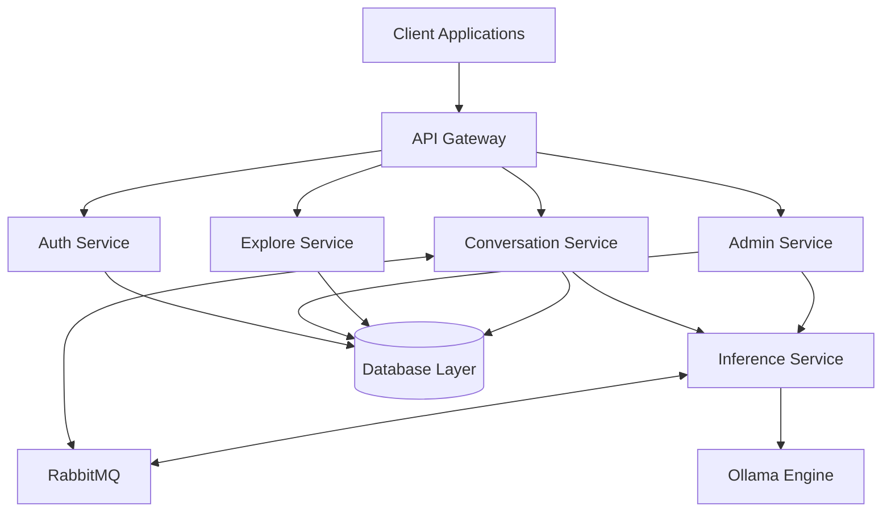
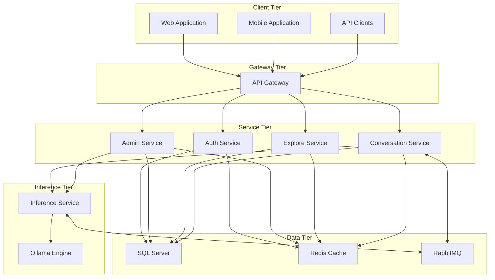
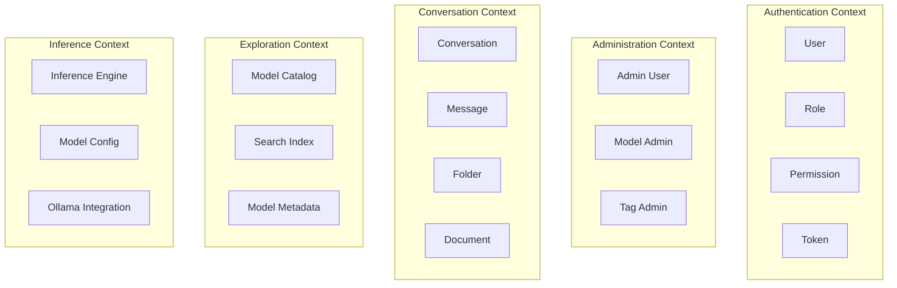
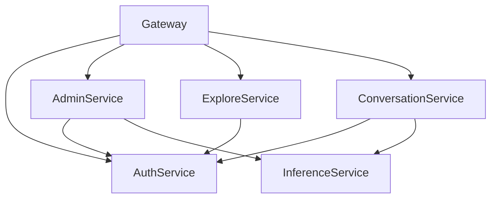
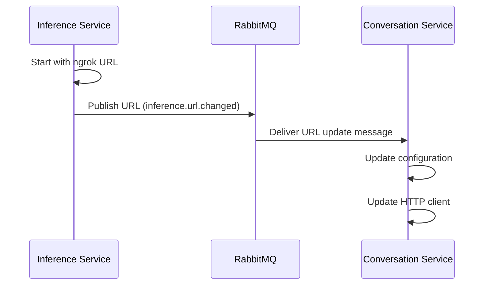
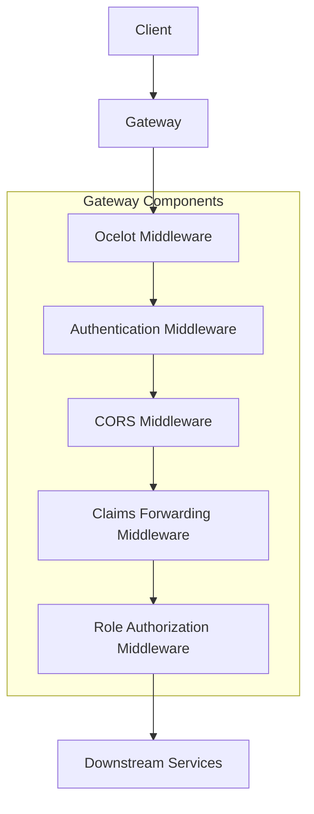
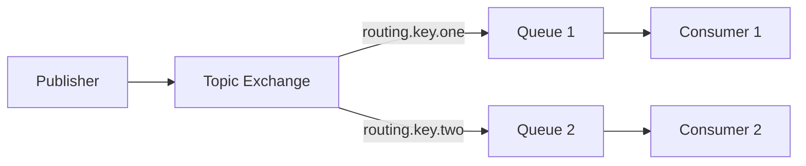
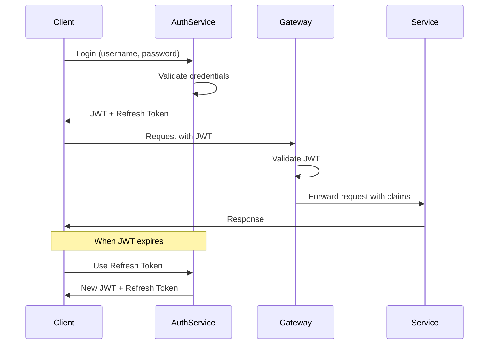

# Chapter 4: System Architecture

## Overall Architecture

### High-level System Architecture Overview

The OllamaNet platform is built on a modern microservices architecture that separates concerns into distinct, independently deployable services. Each service focuses on a specific domain within the system, communicating through well-defined APIs and messaging patterns.



The architecture consists of the following key components:

1. **API Gateway**: Serves as the entry point for all client requests, handling routing, authentication, and cross-cutting concerns.
2. **Auth Service**: Manages user authentication, authorization, and account management.
3. **Admin Service**: Provides administrative capabilities for user and model management.
4. **Explore Service**: Enables discovery and browsing of available AI models.
5. **Conversation Service**: Handles conversation management and interaction with AI models.
6. **Inference Service**: Connects to the Ollama engine for AI model inference.
7. **Database Layer**: Provides data persistence across services.
8. **RabbitMQ**: Facilitates asynchronous communication and service discovery.

### Architectural Principles and Goals

The OllamaNet architecture adheres to the following principles:

1. **Service Independence**: Each service can be developed, deployed, and scaled independently.
2. **Domain-Driven Design**: Services are organized around business domains rather than technical functions.
3. **API-First Design**: All services expose well-defined APIs with consistent patterns.
4. **Resilience by Design**: The system is designed to handle failures gracefully.
5. **Security at Every Layer**: Authentication and authorization are enforced consistently.
6. **Scalability**: Services can be scaled independently based on demand.
7. **Observability**: The system provides monitoring, logging, and diagnostics capabilities.

The architectural goals include:

1. **Maintainability**: Clear separation of concerns makes the system easier to maintain.
2. **Extensibility**: New features can be added with minimal impact on existing components.
3. **Performance**: The architecture optimizes for responsive user experiences.
4. **Security**: The system protects user data and prevents unauthorized access.
5. **Reliability**: The system remains available and consistent even during partial failures.

### System Topology and Deployment View

The OllamaNet system is designed for flexible deployment across various environments:



The deployment architecture supports:

1. **Containerization**: All services are containerized for consistent deployment.
2. **Horizontal Scaling**: Services can be scaled out by adding instances.
3. **Environment Isolation**: Development, testing, and production environments are isolated.
4. **Cloud Deployment**: The system can be deployed to various cloud providers.
5. **On-Premises Deployment**: The system can also be deployed on-premises.

### Key Architectural Decisions and Rationales

| Decision | Rationale |
|----------|-----------|
| Microservices Architecture | Enables independent development, deployment, and scaling of components |
| API Gateway Pattern | Provides a single entry point for clients, simplifying client integration |
| Domain-Driven Design | Aligns services with business domains for better maintainability |
| JWT Authentication | Enables stateless authentication across services |
| SQL Server Database | Provides robust relational data storage with strong consistency |
| Redis Caching | Improves performance by caching frequently accessed data |
| RabbitMQ Messaging | Enables asynchronous communication and service discovery |
| Notebook-First Inference | Allows flexible deployment of inference capabilities in cloud environments |

## Service Decomposition Strategy

### Microservice Boundaries and Responsibilities

The OllamaNet platform is decomposed into services based on business domains and responsibilities:

1. **Auth Service**
   - User registration and authentication
   - JWT token issuance and validation
   - Role and permission management
   - User profile management

2. **Admin Service**
   - User account administration
   - AI model management and deployment
   - Tag and category management
   - System configuration and monitoring

3. **Explore Service**
   - AI model discovery and browsing
   - Search and filtering capabilities
   - Model metadata presentation
   - Caching for performance optimization

4. **Conversation Service**
   - Conversation management and organization
   - Chat interaction with AI models
   - Document processing for context enhancement
   - Folder and organization features

5. **Inference Service (Spicy Avocado)**
   - AI model inference and response generation
   - Service discovery via RabbitMQ
   - Notebook-first architecture for cloud deployment
   - Integration with Ollama engine

6. **Gateway Service**
   - Request routing to appropriate services
   - Authentication and authorization enforcement
   - Cross-cutting concerns like CORS and rate limiting
   - Request/response transformation

### Domain-Driven Design Application

The service decomposition follows Domain-Driven Design principles:

1. **Bounded Contexts**: Each service represents a distinct bounded context with its own domain model.
2. **Ubiquitous Language**: Each service uses consistent terminology within its domain.
3. **Aggregates**: Domain entities are organized into aggregates with clear boundaries.
4. **Domain Events**: Services communicate through domain events when appropriate.



### Service Granularity Decisions

The service granularity in OllamaNet balances several factors:

1. **Business Domain Alignment**: Services align with distinct business capabilities.
2. **Team Ownership**: Services can be owned by specific teams.
3. **Deployment Independence**: Services can be deployed independently.
4. **Scalability Requirements**: Services can be scaled based on their specific load patterns.

For example, the Inference Service is separated from the Conversation Service because:
- It has different scaling requirements (compute-intensive)
- It has a unique deployment model (notebook-first architecture)
- It integrates with external systems (Ollama engine)

### Service Composition and Dependencies

Services in OllamaNet have the following dependencies:

1. **Auth Service**: No dependencies on other services
2. **Admin Service**: Depends on Auth Service for authentication
3. **Explore Service**: Depends on Auth Service for authentication
4. **Conversation Service**: 
   - Depends on Auth Service for authentication
   - Depends on Inference Service for AI model responses
5. **Inference Service**: No direct dependencies on other services
6. **Gateway Service**: Depends on all services for routing



## Service Discovery and Registry

### Service Discovery Mechanisms

OllamaNet implements service discovery using RabbitMQ, particularly for the dynamic discovery of Inference Service endpoints:

1. **Publisher-Subscriber Pattern**: Services publish their endpoints to RabbitMQ topics.
2. **Topic Exchange**: A "service-discovery" exchange routes messages based on routing keys.
3. **Routing Keys**: Structured keys like "inference.url.changed" identify message types.
4. **Message Format**: JSON messages contain service URLs and metadata.



### Dynamic Service URL Configuration

The system handles dynamic URL configuration through several mechanisms:

1. **Initial Configuration**: Services start with default URLs from configuration files.
2. **Runtime Updates**: Services receive URL updates via RabbitMQ messages.
3. **Configuration Service**: A central service manages and distributes configuration.
4. **Caching**: Updated URLs are cached in Redis for persistence across restarts.

```csharp
public async Task UpdateBaseUrl(string newUrl)
{
    if (string.IsNullOrEmpty(newUrl) || _currentBaseUrl == newUrl)
        return;
        
    if (!_urlValidator.IsValid(newUrl))
    {
        _logger.LogWarning("Received invalid URL update: {Url}", newUrl);
        return;
    }
    
    _currentBaseUrl = newUrl;
    await _redisCacheService.SetStringAsync(CACHE_KEY, newUrl);
    _logger.LogInformation("InferenceEngine URL updated to: {Url}", newUrl);
    
    BaseUrlChanged?.Invoke(newUrl);
}
```

### Service Registration Approaches

Services register themselves through different mechanisms:

1. **Static Registration**: Most services have static endpoints defined in configuration.
2. **Dynamic Registration**: The Inference Service dynamically registers its endpoint.
3. **Health Checks**: Services provide health check endpoints for availability monitoring.
4. **Service Metadata**: Registration includes service metadata like version and capabilities.

### Service Health Monitoring

The system monitors service health through several approaches:

1. **Health Check Endpoints**: Each service exposes a `/health` endpoint.
2. **Circuit Breakers**: Services implement circuit breakers to detect and handle failures.
3. **Heartbeats**: Services send periodic heartbeats to indicate liveness.
4. **Logging and Monitoring**: Centralized logging captures service health events.

## API Gateway

### Gateway Architecture Using Ocelot

The OllamaNet Gateway is built using the Ocelot API Gateway library, providing a robust and flexible routing solution:



Key components of the Gateway architecture include:

1. **Ocelot Core**: Handles request routing based on configuration.
2. **Middleware Pipeline**: Processes requests through a series of middleware components.
3. **Configuration System**: Manages routing and other gateway settings.
4. **Authentication Integration**: Validates JWT tokens and enforces security.

### Routing Configuration and Management

The Gateway uses a modular configuration approach:

1. **Service-Specific Configurations**: Each service has its own configuration file.
2. **Variable Substitution**: Service URLs are defined centrally and referenced via variables.
3. **Dynamic Reloading**: Configuration changes are detected and applied without restart.
4. **Aggregation**: Individual configurations are combined at runtime.

```json
{
  "Routes": [
    {
      "DownstreamPathTemplate": "/api/auth/{everything}",
      "DownstreamScheme": "https",
      "DownstreamHostAndPorts": [
        {
          "Host": "${Services.Auth.Host}",
          "Port": 443
        }
      ],
      "UpstreamPathTemplate": "/api/auth/{everything}",
      "UpstreamHttpMethod": [ "GET", "POST", "PUT", "DELETE" ]
    }
  ]
}
```

### Authentication and Authorization at Gateway Level

The Gateway handles authentication and authorization through:

1. **JWT Validation**: Validates tokens issued by the Auth Service.
2. **Role-Based Authorization**: Enforces access control based on user roles.
3. **Claims Forwarding**: Extracts user claims and forwards them to downstream services.
4. **Centralized Policy Enforcement**: Applies consistent security policies across all services.

```csharp
public async Task InvokeAsync(HttpContext context)
{
    if (context.User.Identity?.IsAuthenticated ?? false)
    {
        // Extract claims from the authenticated user
        var userId = context.User.FindFirst(ClaimTypes.NameIdentifier)?.Value;
        var email = context.User.FindFirst(ClaimTypes.Email)?.Value;
        var roles = context.User.FindAll(ClaimTypes.Role).Select(c => c.Value);
        
        // Add claims as headers to the request
        if (!string.IsNullOrEmpty(userId))
            context.Request.Headers.Add("X-User-Id", userId);
            
        if (!string.IsNullOrEmpty(email))
            context.Request.Headers.Add("X-User-Email", email);
            
        if (roles.Any())
            context.Request.Headers.Add("X-User-Roles", string.Join(",", roles));
    }
    
    // Continue processing the request
    await _next(context);
}
```

### Request/Response Transformation

The Gateway performs several transformations on requests and responses:

1. **URL Rewriting**: Rewrites URLs based on routing configuration.
2. **Header Manipulation**: Adds, removes, or modifies HTTP headers.
3. **Response Aggregation**: Combines responses from multiple services when needed.
4. **Content Transformation**: Transforms request and response content when required.

### Cross-cutting Concerns Handled at Gateway

The Gateway handles several cross-cutting concerns:

1. **CORS**: Configures and enforces Cross-Origin Resource Sharing policies.
2. **Rate Limiting**: Prevents abuse by limiting request rates.
3. **Logging**: Logs requests and responses for auditing and troubleshooting.
4. **Error Handling**: Provides consistent error responses across services.
5. **Request Tracing**: Adds correlation IDs for request tracking across services.

## Communication Patterns

### Synchronous Communication

#### REST API Design and Implementation

OllamaNet services communicate primarily through RESTful APIs:

1. **Resource-Oriented Design**: APIs are organized around resources.
2. **Standard HTTP Methods**: GET, POST, PUT, DELETE are used appropriately.
3. **Status Codes**: Proper HTTP status codes indicate success or failure.
4. **Content Negotiation**: APIs support multiple content types (primarily JSON).

```csharp
[ApiController]
[Route("api/[controller]")]
public class ConversationsController : ControllerBase
{
    [HttpGet]
    public async Task<ActionResult<IEnumerable<ConversationDto>>> GetConversations()
    {
        // Implementation
    }
    
    [HttpGet("{id}")]
    public async Task<ActionResult<ConversationDto>> GetConversation(Guid id)
    {
        // Implementation
    }
    
    [HttpPost]
    public async Task<ActionResult<ConversationDto>> CreateConversation(CreateConversationDto dto)
    {
        // Implementation
    }
    
    // Other endpoints
}
```

#### Request-Response Patterns

Services implement several request-response patterns:

1. **Synchronous Request-Response**: Client sends a request and waits for a response.
2. **Streaming Responses**: Used for real-time AI model responses.
3. **Pagination**: Large result sets are paginated for efficiency.
4. **Filtering and Sorting**: Clients can specify filters and sort orders.

#### HTTP/HTTPS Communication

All service-to-service communication uses HTTPS with:

1. **TLS Encryption**: All traffic is encrypted using TLS.
2. **Certificate Validation**: Services validate certificates for security.
3. **Connection Pooling**: HTTP clients use connection pooling for efficiency.
4. **Timeout Management**: Appropriate timeouts prevent resource exhaustion.

### Asynchronous Communication

#### Message Broker Usage (RabbitMQ)

OllamaNet uses RabbitMQ for asynchronous communication:

1. **Topic Exchange**: Messages are routed based on routing keys.
2. **Durable Messaging**: Messages persist across broker restarts.
3. **Dead Letter Queues**: Failed messages are sent to dead letter queues for handling.
4. **Consumer Acknowledgments**: Messages are acknowledged when processed successfully.



#### Event-Driven Communication

The system uses event-driven communication for:

1. **Service Discovery**: Inference Service publishes URL updates.
2. **State Changes**: Services publish events when important state changes occur.
3. **Asynchronous Processing**: Long-running operations use events for completion notification.
4. **Integration Events**: Cross-service business processes use events for coordination.

#### Message Formats and Standards

Messages follow these standards:

1. **JSON Format**: All messages use JSON for compatibility.
2. **Metadata Inclusion**: Messages include metadata like timestamp and version.
3. **Schema Validation**: Messages are validated against schemas.
4. **Versioning**: Message formats include version information for compatibility.

```json
{
  "newUrl": "https://example-inference-engine.ngrok-free.app/",
  "timestamp": "2023-08-15T14:30:00Z",
  "serviceId": "inference-engine",
  "version": "1.0"
}
```

#### Publishing and Subscribing Mechanisms

The system implements these messaging patterns:

1. **Publish-Subscribe**: One publisher, multiple subscribers.
2. **Work Queues**: Tasks distributed among multiple workers.
3. **RPC**: Request-reply pattern over messaging.
4. **Broadcast**: Messages sent to all interested parties.

```csharp
public async Task PublishInferenceUrlUpdate(string newUrl)
{
    var message = new InferenceUrlUpdateMessage
    {
        NewUrl = newUrl,
        Timestamp = DateTime.UtcNow
    };
    
    var factory = new ConnectionFactory
    {
        HostName = _options.HostName,
        Port = _options.Port,
        UserName = _options.UserName,
        Password = _options.Password,
        VirtualHost = _options.VirtualHost
    };
    
    using var connection = factory.CreateConnection();
    using var channel = connection.CreateModel();
    
    channel.ExchangeDeclare(
        exchange: _options.Exchange,
        type: ExchangeType.Topic,
        durable: true);
        
    var json = JsonSerializer.Serialize(message);
    var body = Encoding.UTF8.GetBytes(json);
    
    channel.BasicPublish(
        exchange: _options.Exchange,
        routingKey: _options.InferenceUrlRoutingKey,
        basicProperties: null,
        body: body);
}
```

## Cross-Cutting Concerns

### Authentication & Authorization

#### JWT Implementation

OllamaNet implements JWT-based authentication:

1. **Token Issuance**: The Auth Service issues JWT tokens upon successful login.
2. **Token Validation**: The Gateway and services validate tokens before processing requests.
3. **Claims-Based Identity**: Tokens contain claims about the user's identity and roles.
4. **Refresh Tokens**: Long-lived refresh tokens enable session persistence.



#### Role-Based Access Control

The system implements role-based access control:

1. **Role Definitions**: Users are assigned roles (Admin, User, etc.).
2. **Permission Mapping**: Roles map to permissions for specific operations.
3. **Gateway Enforcement**: The Gateway enforces role requirements for routes.
4. **Service-Level Checks**: Services perform additional authorization checks as needed.

```json
{
  "RoleAuthorization": [
    {
      "PathTemplate": "/api/admin/*",
      "RequiredRole": "Admin"
    },
    {
      "PathTemplate": "/api/conversations/*",
      "RequiredRole": "User"
    }
  ]
}
```

#### Claims Forwarding Between Services

User claims are forwarded between services:

1. **Gateway Extraction**: The Gateway extracts claims from JWT tokens.
2. **Header Injection**: Claims are added as HTTP headers to downstream requests.
3. **Service Validation**: Services validate and use the forwarded claims.
4. **Consistent Identity**: User identity is maintained across service boundaries.

### Logging & Monitoring

#### Centralized Logging Approach

OllamaNet implements centralized logging:

1. **Structured Logging**: All logs use a structured format (JSON).
2. **Log Levels**: Appropriate log levels (Debug, Info, Warning, Error) are used.
3. **Correlation IDs**: Requests are tracked across services using correlation IDs.
4. **Contextual Information**: Logs include relevant context for troubleshooting.

#### Monitoring Strategies

The system is monitored through:

1. **Health Checks**: Services expose health check endpoints.
2. **Metrics Collection**: Key performance metrics are collected.
3. **Alerting**: Alerts are triggered for critical issues.
4. **Dashboard Visualization**: Metrics are visualized in dashboards.

#### Observability Features

Observability is achieved through:

1. **Distributed Tracing**: Requests are traced across service boundaries.
2. **Performance Metrics**: Response times, throughput, and error rates are tracked.
3. **Resource Utilization**: CPU, memory, and network usage are monitored.
4. **Business Metrics**: Key business metrics are tracked for insights.

### Resilience Patterns

#### Circuit Breaker Patterns

Circuit breakers prevent cascading failures:

1. **Failure Detection**: Tracks failures in downstream service calls.
2. **Open Circuit**: Stops calls to failing services after threshold is reached.
3. **Half-Open State**: Allows test calls to check if service has recovered.
4. **Closed Circuit**: Normal operation when service is healthy.

```csharp
// Configure HTTP client with circuit breaker
services.AddHttpClient<IInferenceEngineConnector, InferenceEngineConnector>()
    .AddPolicyHandler(GetCircuitBreakerPolicy());
    
private IAsyncPolicy<HttpResponseMessage> GetCircuitBreakerPolicy()
{
    return HttpPolicyExtensions
        .HandleTransientHttpError()
        .CircuitBreakerAsync(
            handledEventsAllowedBeforeBreaking: 5,
            durationOfBreak: TimeSpan.FromSeconds(30)
        );
}
```

#### Retry Policies

Retry policies handle transient failures:

1. **Retry Count**: Specifies how many retries to attempt.
2. **Backoff Strategy**: Implements exponential backoff between retries.
3. **Retry Triggers**: Defines which errors trigger retries.
4. **Timeout**: Sets maximum time for operation with retries.

```csharp
private IAsyncPolicy<HttpResponseMessage> GetRetryPolicy()
{
    return HttpPolicyExtensions
        .HandleTransientHttpError()
        .OrResult(msg => msg.StatusCode == System.Net.HttpStatusCode.TooManyRequests)
        .WaitAndRetryAsync(
            retryCount: 3,
            sleepDurationProvider: retryAttempt => TimeSpan.FromSeconds(Math.Pow(2, retryAttempt))
        );
}
```

#### Timeout Management

The system manages timeouts at multiple levels:

1. **Request Timeouts**: HTTP requests have appropriate timeouts.
2. **Operation Timeouts**: Complex operations have overall timeouts.
3. **Graceful Degradation**: Services degrade gracefully when timeouts occur.
4. **User Feedback**: Users are informed about timeouts when appropriate.

#### Fallback Strategies

Fallback strategies provide alternatives when operations fail:

1. **Cached Data**: Return cached data when live data is unavailable.
2. **Default Values**: Use sensible defaults when actual values cannot be retrieved.
3. **Degraded Functionality**: Provide limited functionality rather than complete failure.
4. **User Notification**: Inform users when fallbacks are used.

┌─ Terminology ──────────────────────────────────────────────────┐
│                                                                │
│ **API Gateway**: Component that acts as an entry point for     │
│ client requests to microservices                               │
│                                                                │
│ **Circuit Breaker**: Pattern that prevents cascading failures  │
│ across services                                                │
│                                                                │
│ **JWT**: JSON Web Token used for authentication between        │
│ services                                                       │
│                                                                │
│ **Microservice**: Independent deployable service with a        │
│ specific domain responsibility                                 │
│                                                                │
│ **RabbitMQ**: Message broker used for asynchronous             │
│ communication and service discovery                            │
│                                                                │
└────────────────────────────────────────────────────────────────┘ 