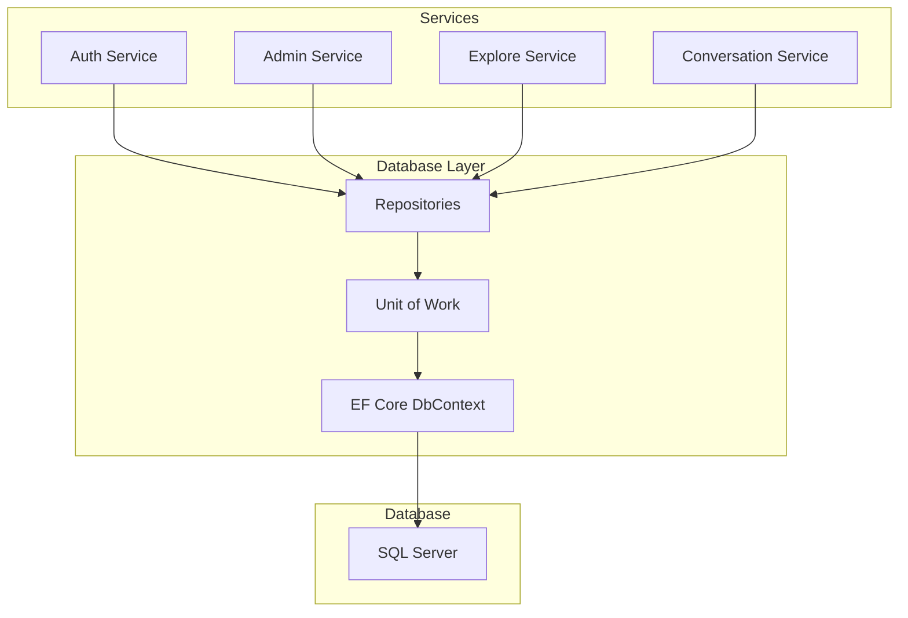
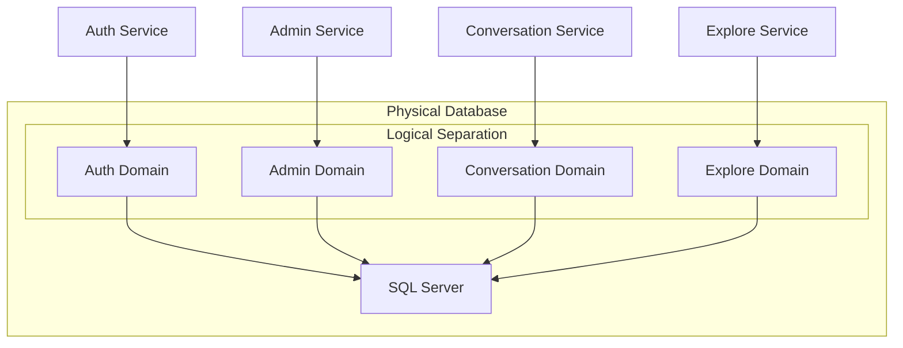
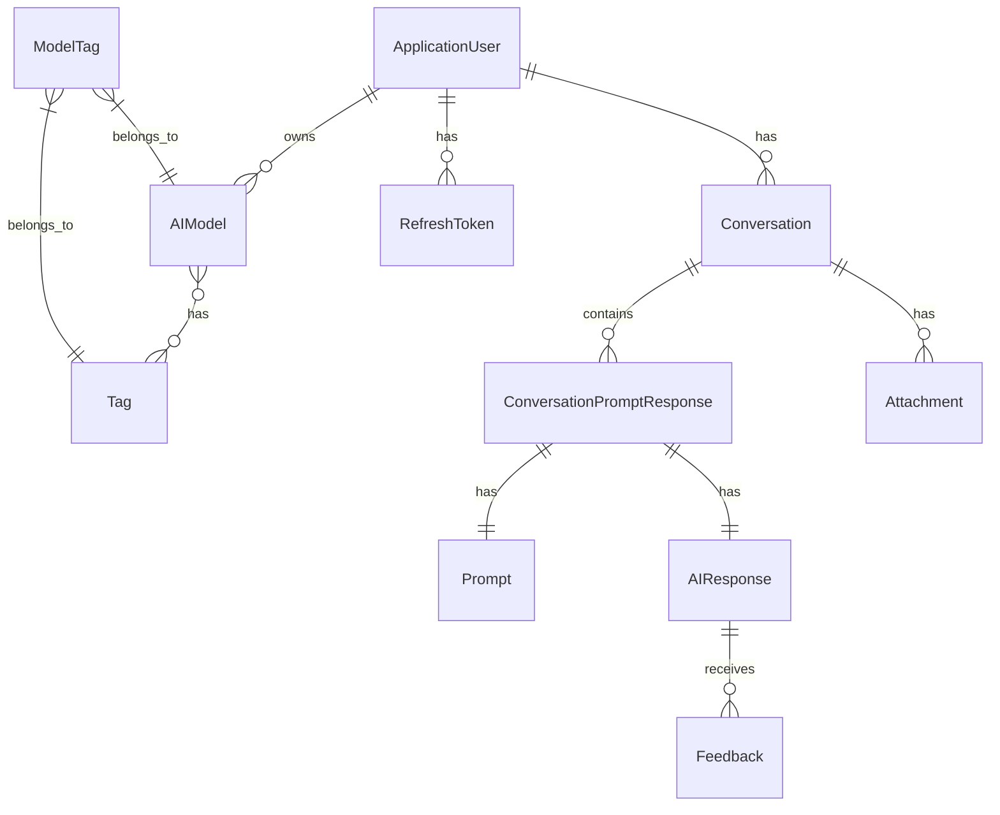

# Chapter 5: Database Layer

## Database Architecture

### Overall Database Design Philosophy

The OllamaNet platform employs a robust database architecture that balances the needs of a microservices ecosystem with the benefits of relational data integrity. The database layer is designed around several key principles:

1. **Shared Database with Logical Separation**: While microservices often employ separate databases, OllamaNet uses a shared SQL Server database with logical separation to maintain data integrity while providing service isolation.

2. **Repository Pattern**: Data access is abstracted through repositories, providing a consistent interface for services to interact with the database.

3. **Unit of Work Pattern**: Transactions across multiple repositories are coordinated through a Unit of Work implementation, ensuring data consistency.

4. **Domain-Driven Design**: The database schema reflects the domain model, with clear entity boundaries and relationships that map to business concepts.

5. **Soft Delete**: Entities implement soft deletion to preserve historical data while allowing logical removal.



### Database Per Service Pattern Consideration

The OllamaNet architecture considered the Database-per-Service pattern, which is common in microservices architectures, but ultimately chose a shared database approach for several reasons:

1. **Data Integrity**: A shared database ensures referential integrity across services, which is particularly important for user data and relationships.

2. **Simplified Deployment**: A single database reduces operational complexity compared to managing multiple databases.

3. **Query Efficiency**: Cross-service queries can be performed more efficiently within a single database.

4. **Transaction Support**: ACID transactions across related data are easier to implement in a shared database.

However, to maintain service independence, the architecture implements logical separation through:

1. **Service-Specific Repositories**: Each service accesses only its relevant entities through dedicated repositories.

2. **Schema Namespacing**: Database tables are organized into logical groups aligned with service boundaries.

3. **Access Control**: Services are restricted to their own data domains through repository interfaces.

### Shared Database Implementation

The shared database implementation uses Entity Framework Core as an ORM, with the following components:

1. **Central DbContext**: A single `MyDbContext` class that extends `IdentityDbContext<ApplicationUser>` and includes all entity DbSets.

2. **Entity Configuration**: Entity relationships and constraints are configured in the `OnModelCreating` method of the DbContext.

3. **Service-Specific Repositories**: Each service has dedicated repositories that access only the entities relevant to that service.

4. **Unit of Work Coordinator**: A central `UnitOfWork` class coordinates operations across repositories and manages transactions.

```csharp
public class MyDbContext : IdentityDbContext<ApplicationUser>
{
    public MyDbContext(DbContextOptions<MyDbContext> options) : base(options) { }

    public DbSet<AIModel> AIModels { get; set; }
    public DbSet<AIResponse> AIResponses { get; set; }
    public DbSet<Attachment> Attachments { get; set; }
    public DbSet<Conversation> Conversations { get; set; }
    public DbSet<ConversationPromptResponse> ConversationPromptResponses { get; set; }
    public DbSet<Feedback> Feedbacks { get; set; }
    public DbSet<ModelTag> ModelTags { get; set; }
    public DbSet<Prompt> Prompts { get; set; }
    public DbSet<RefreshToken> RefreshTokens { get; set; }
    public DbSet<SystemMessage> SystemMessages { get; set; }
    public DbSet<Tag> Tags { get; set; }

    protected override void OnModelCreating(ModelBuilder modelBuilder)
    {
        base.OnModelCreating(modelBuilder);

        // Configure ModelTag as a join entity
        modelBuilder.Entity<ModelTag>().HasKey(mt => new { mt.ModelId, mt.TagId });

        // Other entity configurations...
    }
}
```

### Physical vs. Logical Database Separation

OllamaNet employs logical separation within a physically shared database:

1. **Physical Sharing**: All services access the same SQL Server instance and database.

2. **Logical Separation**:
   - Each service accesses only its domain-specific entities
   - Repository interfaces expose only relevant operations
   - Service boundaries are enforced at the application level

This approach provides several benefits:

1. **Data Consistency**: Ensures consistent data across services.
2. **Simplified Transactions**: Enables ACID transactions across related entities.
3. **Efficient Queries**: Allows for efficient joins between related entities.
4. **Reduced Operational Complexity**: Simplifies database management and deployment.



### Design Principles and Patterns

The database layer implements several key design principles and patterns:

1. **Repository Pattern**: Abstracts data access logic and provides a consistent interface for working with entities.

```csharp
public interface IRepository<T> where T : class
{
    Task<IEnumerable<T>> GetAllAsync();
    Task<T> GetByIdAsync(string id);
    Task<bool> AddAsync(T entity);
    Task<bool> UpdateAsync(T entity);
    Task<bool> DeleteAsync(string id);
    Task<bool> SoftDeleteAsync(string id);
    Task<bool> ExistsAsync(string id);
}
```

2. **Unit of Work Pattern**: Coordinates operations across multiple repositories and provides a single point for committing changes.

```csharp
public interface IUnitOfWork : IDisposable
{
    IAIModelRepository AIModels { get; }
    IAIResponseRepository AIResponses { get; }
    // Other repositories...
    
    Task<int> SaveChangesAsync();
}
```

3. **Identity Integration**: Extends ASP.NET Identity with custom user properties and relationships.

4. **Soft Delete Pattern**: Implements logical deletion through an `IsDeleted` flag on entities.

5. **Query Specification Pattern**: Encapsulates query logic for complex filtering and sorting.

6. **Eager Loading Strategy**: Uses explicit loading of related entities to avoid N+1 query problems.

## Data Models

### Entity Relationship Diagrams

The OllamaNet database schema includes several interconnected entities that support the platform's functionality:



### Schema Designs

The database schema is organized around several key domains:

1. **User Management Domain**:
   - ApplicationUser (extends IdentityUser)
   - RefreshToken

2. **Model Management Domain**:
   - AIModel
   - Tag
   - ModelTag (junction entity)

3. **Conversation Domain**:
   - Conversation
   - ConversationPromptResponse
   - Prompt
   - AIResponse
   - Attachment
   - Feedback

4. **System Configuration Domain**:
   - SystemMessage

Each entity includes standard fields for tracking creation, modification, and deletion:

```csharp
// Common fields found in most entities
public string Id { get; set; }
public DateTime CreatedAt { get; set; }
public bool IsDeleted { get; set; }
```

### Domain Model to Database Mapping

The OllamaNet platform maps its domain model to the database schema using Entity Framework Core's fluent API and data annotations:

1. **Entity Configuration**:
   - Primary keys defined using the `[Key]` attribute or fluent API
   - Foreign keys established through the fluent API
   - Navigation properties configured for relationships

2. **Relationship Mapping**:
   - One-to-Many: Defined through navigation properties and foreign keys
   - Many-to-Many: Implemented using junction entities (e.g., ModelTag)
   - One-to-One: Configured with unique foreign keys

3. **Property Mapping**:
   - Data types specified through attributes or fluent API
   - Required fields marked with the `[Required]` attribute
   - String length constraints applied where appropriate

Example of entity configuration in the DbContext:

```csharp
protected override void OnModelCreating(ModelBuilder modelBuilder)
{
    base.OnModelCreating(modelBuilder);

    // Configure ModelTag as a join entity
    modelBuilder.Entity<ModelTag>().HasKey(mt => new { mt.ModelId, mt.TagId });

    modelBuilder.Entity<ModelTag>()
        .HasOne(mt => mt.Model)
        .WithMany(m => m.ModelTags)
        .HasForeignKey(mt => mt.ModelId);

    modelBuilder.Entity<ModelTag>()
        .HasOne(mt => mt.Tag)
        .WithMany(t => t.ModelTags)
        .HasForeignKey(mt => mt.TagId);
}
```

### Database Constraints and Validations

The OllamaNet database implements several types of constraints and validations:

1. **Primary Key Constraints**: Each entity has a unique identifier, typically a string containing a GUID.

2. **Foreign Key Constraints**: Relationships between entities are enforced through foreign keys.

3. **Required Field Constraints**: Critical fields are marked as required to prevent null values.

4. **String Length Constraints**: String fields have appropriate length constraints.

5. **Unique Constraints**: Applied to fields that must be unique, such as usernames and email addresses.

6. **Default Values**: Some fields have default values, such as `IsDeleted = false` and `CreatedAt = DateTime.UtcNow`.

7. **Check Constraints**: Used to enforce business rules, such as valid status values.

These constraints are implemented through a combination of Entity Framework Core configurations and database-level constraints.

### Soft Delete Implementation

OllamaNet implements soft deletion across its entities to preserve historical data while allowing logical removal:

1. **IsDeleted Flag**: Each entity includes an `IsDeleted` boolean property.

2. **Repository Filtering**: Repositories automatically filter out entities where `IsDeleted = true`.

```csharp
public async Task<IEnumerable<Tag>> GetAllAsync()
{
    return await _context.Tags
        .Where(t => !t.IsDeleted)
        .ToListAsync();
}
```

3. **Soft Delete Operation**: Instead of physically removing entities, the `SoftDeleteAsync` method sets `IsDeleted = true`.

```csharp
public async Task<bool> SoftDeleteAsync(string id)
{
    var tag = await _context.Tags.FindAsync(id);
    if (tag == null)
        return false;

    tag.IsDeleted = true;
    _context.Tags.Update(tag);
    return true;
}
```

4. **Query Extensions**: Extension methods automatically apply soft delete filtering to queries.

This approach provides several benefits:
- Preserves historical data for auditing and analysis
- Allows for data recovery if needed
- Maintains referential integrity across related entities
- Simplifies compliance with data retention requirements

## Data Consistency Strategies

### Eventual Consistency Approaches

While OllamaNet primarily uses a shared database with strong consistency, it also implements eventual consistency patterns for specific scenarios:

1. **Cache Synchronization**: Redis caching is used with appropriate invalidation strategies to ensure eventual consistency between the cache and the database.

2. **Read-Your-Writes Consistency**: The system ensures that after a write operation, subsequent reads will reflect the changes, even when caching is involved.

3. **Background Processing**: Some operations are performed asynchronously, with eventual consistency guaranteed through reliable message processing.

4. **Optimistic Concurrency**: Entity Framework's optimistic concurrency control is used to detect and resolve conflicts when multiple services update the same data.

### Saga Pattern Implementation

For complex operations that span multiple services, OllamaNet implements a simplified version of the Saga pattern:

1. **Coordinated Transactions**: The Unit of Work pattern coordinates transactions within a single service.

2. **Compensating Transactions**: For cross-service operations, compensating transactions are implemented to roll back changes if a step fails.

3. **Event-Driven Coordination**: Services publish events to signal completion of their part of a distributed transaction.

This approach helps maintain data consistency across service boundaries while avoiding distributed transactions.

### Distributed Transactions Handling

OllamaNet avoids distributed transactions where possible, but implements several strategies for maintaining consistency across services:

1. **Service Composition**: Complex operations are composed at the API level rather than using distributed transactions.

2. **Event-Driven Updates**: Services subscribe to events from other services to update their data accordingly.

3. **Idempotent Operations**: APIs are designed to be idempotent, allowing safe retries of failed operations.

4. **Consistency Verification**: Background processes verify and reconcile data consistency across services.

### Concurrency Control Mechanisms

The database layer implements several concurrency control mechanisms:

1. **Optimistic Concurrency**: Entity Framework's optimistic concurrency control is used to detect conflicts during updates.

```csharp
modelBuilder.Entity<AIModel>()
    .Property(p => p.RowVersion)
    .IsRowVersion();
```

2. **Pessimistic Locking**: For critical operations, explicit database locks are used to prevent concurrent modifications.

3. **Transaction Isolation Levels**: Appropriate transaction isolation levels are set based on the operation's requirements.

```csharp
using var transaction = await _context.Database.BeginTransactionAsync(IsolationLevel.ReadCommitted);
try
{
    // Perform operations
    await _context.SaveChangesAsync();
    await transaction.CommitAsync();
}
catch
{
    await transaction.RollbackAsync();
    throw;
}
```

### Error Handling and Rollback Strategies

The database layer implements robust error handling and rollback strategies:

1. **Transaction Scope**: Operations that modify multiple entities are wrapped in transactions to ensure atomicity.

```csharp
public async Task<bool> CreateConversationWithPromptAsync(Conversation conversation, Prompt prompt, AIResponse response)
{
    // Add entities
    await _unitOfWork.Conversations.AddAsync(conversation);
    await _unitOfWork.Prompts.AddAsync(prompt);
    await _unitOfWork.AIResponses.AddAsync(response);
    
    // Create relationship
    var cpr = new ConversationPromptResponse
    {
        Id = Guid.NewGuid().ToString(),
        ConversationId = conversation.Id,
        PromptId = prompt.Id,
        AIResponseId = response.Id,
        CreatedAt = DateTime.UtcNow
    };
    
    await _unitOfWork.ConversationPromptResponses.AddAsync(cpr);
    
    // Save all changes in a single transaction
    await _unitOfWork.SaveChangesAsync();
    
    return true;
}
```

2. **Exception Handling**: Exceptions during database operations are caught and handled appropriately, with transactions rolled back when necessary.

3. **Retry Logic**: Transient errors are handled with retry logic to improve resilience.

4. **Logging**: Database errors are logged with sufficient context for troubleshooting.

## Database Technologies

### SQL Server Implementation Details

OllamaNet uses SQL Server as its primary database technology:

1. **Version**: SQL Server 2019 or later, supporting modern features like JSON support and improved performance.

2. **Connection Management**: Connection pooling is configured for optimal performance and resource utilization.

3. **Indexing Strategy**: Appropriate indexes are created for frequently queried fields to optimize performance.

4. **Query Optimization**: Complex queries are optimized using query hints and execution plan analysis.

5. **Security Configuration**: SQL Server is configured with appropriate security settings, including encryption and access controls.

### Entity Framework Core Configuration

Entity Framework Core is configured for optimal performance and functionality:

1. **DbContext Configuration**: The `MyDbContext` is configured with appropriate options for tracking, batching, and logging.

```csharp
services.AddDbContext<MyDbContext>(options =>
    options.UseSqlServer(Configuration.GetConnectionString("DefaultConnection"),
        sqlOptions =>
        {
            sqlOptions.EnableRetryOnFailure(
                maxRetryCount: 5,
                maxRetryDelay: TimeSpan.FromSeconds(30),
                errorNumbersToAdd: null);
        })
    .UseQueryTrackingBehavior(QueryTrackingBehavior.NoTracking)
    .EnableSensitiveDataLogging(isDevelopment));
```

2. **Entity Configuration**: Entities are configured using a combination of data annotations and the fluent API.

3. **Lazy Loading**: Lazy loading is disabled by default to prevent N+1 query problems, with explicit loading used when needed.

4. **Query Filters**: Global query filters are applied for soft delete and multi-tenancy.

```csharp
modelBuilder.Entity<Conversation>()
    .HasQueryFilter(c => !c.IsDeleted);
```

5. **Performance Optimization**: Query compilation is cached, and query execution is optimized through appropriate includes and projections.

### Redis Caching Implementation

OllamaNet uses Redis for distributed caching to improve performance:

1. **Cache Architecture**: A multi-level caching approach with in-memory and Redis caches.

2. **Cache-Aside Pattern**: Data is retrieved from the cache first, with database fallback when needed.

```csharp
public async Task<T> GetOrSetAsync<T>(string key, Func<Task<T>> factory, TimeSpan? expiry = null)
{
    try
    {
        var cachedValue = await _redisCacheService.GetAsync<T>(key);
        if (cachedValue != null)
        {
            _logger.LogDebug("Cache hit for key: {Key}", key);
            return cachedValue;
        }

        _logger.LogDebug("Cache miss for key: {Key}", key);
        var result = await factory();
        
        if (result != null)
        {
            await _redisCacheService.SetAsync(key, result, expiry ?? _defaultExpiry);
        }
        
        return result;
    }
    catch (Exception ex)
    {
        _logger.LogWarning(ex, "Cache operation failed for key: {Key}, falling back to data source", key);
        return await factory();
    }
}
```

3. **Cache Invalidation**: When data changes, related cache entries are invalidated to maintain consistency.

4. **Cache Resilience**: The system gracefully handles Redis unavailability by falling back to the database.

5. **Cache Optimization**: Frequently accessed data is cached with appropriate expiration policies.

### Query Optimization Techniques

OllamaNet implements several query optimization techniques:

1. **Indexing Strategy**: Appropriate indexes are created for frequently queried fields.

2. **Query Projection**: Queries project only the required fields rather than loading entire entities.

```csharp
public async Task<IEnumerable<ModelDto>> GetAllModelsAsync()
{
    return await _context.AIModels
        .Where(m => !m.IsDeleted)
        .Select(m => new ModelDto
        {
            Id = m.Id,
            Name = m.Name,
            Description = m.Description,
            // Only select needed properties
        })
        .ToListAsync();
}
```

3. **Eager Loading**: Related entities are loaded using explicit includes to avoid N+1 query problems.

```csharp
public async Task<Conversation> GetConversationWithDetailsAsync(string id)
{
    return await _context.Conversations
        .Include(c => c.ConversationPromptResponses)
            .ThenInclude(cpr => cpr.Prompt)
        .Include(c => c.ConversationPromptResponses)
            .ThenInclude(cpr => cpr.AIResponse)
        .FirstOrDefaultAsync(c => c.Id == id && !c.IsDeleted);
}
```

4. **Pagination**: Large result sets are paginated to improve performance.

```csharp
public async Task<IEnumerable<Conversation>> GetConversationsPagedAsync(
    string userId, int pageNumber, int pageSize)
{
    return await _context.Conversations
        .Where(c => c.UserId == userId && !c.IsDeleted)
        .OrderByDescending(c => c.CreatedAt)
        .Skip((pageNumber - 1) * pageSize)
        .Take(pageSize)
        .ToListAsync();
}
```

5. **Query Caching**: Frequently executed queries are cached to reduce database load.

### Connection Management

OllamaNet implements effective connection management strategies:

1. **Connection Pooling**: Entity Framework Core's connection pooling is configured for optimal performance.

2. **Connection Resilience**: Retry logic is implemented for transient connection failures.

3. **Connection Monitoring**: Connection usage is monitored to detect leaks and performance issues.

4. **Connection Timeout**: Appropriate connection timeouts are configured to prevent resource exhaustion.

5. **Connection Security**: Connections use encrypted communication and minimal privilege accounts.

## Data Migration and Versioning

### Migration Strategy

OllamaNet uses Entity Framework Core migrations for database schema evolution:

1. **Migration Generation**: Migrations are generated using the EF Core Tools when entity models change.

```bash
dotnet ef migrations add AddConversationStatus
```

2. **Migration Application**: Migrations are applied during application startup or through deployment scripts.

```csharp
public void Configure(IApplicationBuilder app, IWebHostEnvironment env)
{
    // Apply migrations at startup
    using (var scope = app.ApplicationServices.CreateScope())
    {
        var dbContext = scope.ServiceProvider.GetRequiredService<MyDbContext>();
        dbContext.Database.Migrate();
    }
    
    // Other configuration...
}
```

3. **Migration Testing**: Migrations are tested in development and staging environments before production deployment.

4. **Rollback Strategy**: Each migration has a corresponding down method for rollback if needed.

### Schema Evolution Approach

OllamaNet follows a careful approach to schema evolution:

1. **Additive Changes**: Prefer adding new tables or columns rather than modifying existing ones.

2. **Backward Compatibility**: Maintain backward compatibility with existing code when possible.

3. **Phased Deployment**: Complex schema changes are deployed in phases to minimize risk.

4. **Data Migration**: Include data migration logic when schema changes affect existing data.

```csharp
migrationBuilder.Sql(@"
    UPDATE Conversations
    SET Status = 'Active'
    WHERE Status IS NULL
");
```

### Backward Compatibility Considerations

The database layer maintains backward compatibility through several strategies:

1. **Default Values**: New columns have sensible default values to support existing code.

2. **Nullable Columns**: New columns are added as nullable when appropriate.

3. **View Compatibility**: Database views are used to maintain compatibility with legacy queries.

4. **API Versioning**: API versions are maintained to support clients using older data models.

### Deployment Practices for Database Changes

OllamaNet follows these best practices for database deployments:

1. **Automated Migrations**: Database migrations are part of the automated deployment pipeline.

2. **Validation Scripts**: Pre-deployment validation scripts verify that migrations can be applied safely.

3. **Backup Strategy**: Database backups are created before applying migrations.

4. **Deployment Windows**: Database changes are deployed during low-traffic periods.

5. **Monitoring**: Database performance is monitored during and after migration application.

### Database Versioning Approach

The database schema is versioned using several mechanisms:

1. **Migration History**: EF Core's migration history table tracks applied migrations.

2. **Semantic Versioning**: Database schema versions follow semantic versioning principles.

3. **Documentation**: Schema changes are documented with each migration.

4. **Version Compatibility**: The application verifies database schema compatibility at startup.

```csharp
public void EnsureDatabaseCompatibility(MyDbContext context)
{
    var pendingMigrations = context.Database.GetPendingMigrations();
    if (pendingMigrations.Any())
    {
        throw new Exception($"Database is out of date. {pendingMigrations.Count()} migrations need to be applied.");
    }
}
```

┌─ Terminology ──────────────────────────────────────────────────┐
│                                                                │
│ **Repository Pattern**: Design pattern that mediates between   │
│ the domain model and data source                               │
│                                                                │
│ **Unit of Work**: Pattern that maintains a list of objects     │
│ affected by a business transaction                             │
│                                                                │
│ **Entity Framework Core**: Object-relational mapper used for   │
│ database access                                                │
│                                                                │
│ **Soft Delete**: Pattern for marking records as deleted        │
│ without physically removing them                               │
│                                                                │
└────────────────────────────────────────────────────────────────┘ 