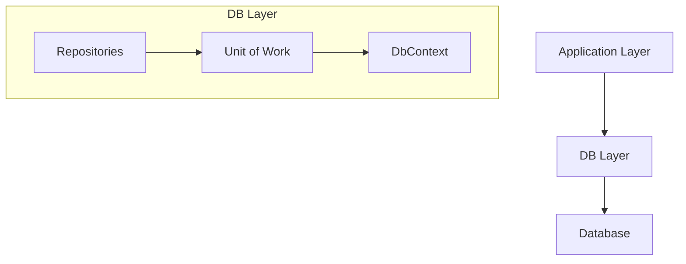
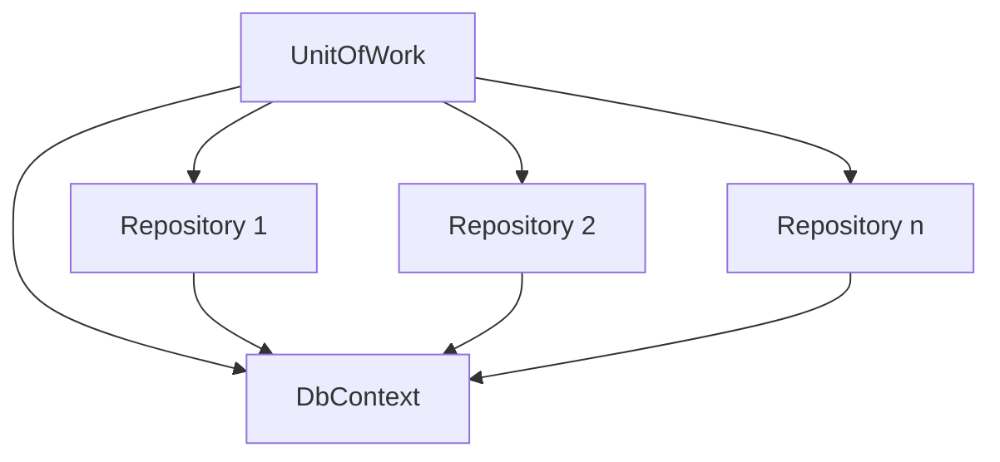

# System Patterns: Ollama DB Layer

## System Architecture

The Ollama DB Layer follows a layered architecture focused on data access concerns:



The architecture consists of the following components:

1. **Entities**: POCO (Plain Old CLR Objects) classes that represent database tables and their relationships.
2. **DbContext**: The Entity Framework Core context that manages entity instances and provides a connection to the database.
3. **Repositories**: Classes that encapsulate data access logic for specific entity types.
4. **Unit of Work**: A coordinator that manages transactions across multiple repositories.

## Key Technical Decisions

1. **Entity Framework Core**: Chosen as the ORM (Object-Relational Mapper) to simplify data access and leverage its rich feature set.

2. **Repository Pattern**: Implemented to abstract data access logic and provide a consistent interface for working with entities.

3. **Unit of Work Pattern**: Adopted to coordinate operations across multiple repositories and manage transactions.

4. **ASP.NET Identity Integration**: Used for user management, authentication, and authorization.

5. **Soft Delete**: Implemented across entities to preserve data history while allowing logical deletion.

6. **Dependency Injection**: Utilized for loose coupling between components and improved testability.

## Design Patterns in Use

### Repository Pattern

Each entity has a dedicated repository that implements a common interface (`IRepository<T>`) with standard CRUD operations:

```csharp
public interface IRepository<T> where T : class
{
    Task<T> GetByIdAsync(string id);
    Task<IEnumerable<T>> GetAllAsync();
    Task AddAsync(T entity);
    Task UpdateAsync(T entity);
    Task DeleteAsync(string id);
    Task SoftDeleteAsync(string id);
}
```

Specific repositories extend this interface with additional methods as needed for their entity types.

### Unit of Work Pattern

The `UnitOfWork` class coordinates operations across multiple repositories and provides a single point for committing changes to the database:

```csharp
public interface IUnitOfWork : IDisposable
{
    // Repository properties
    IAIModelRepository AIModelRepo { get; }
    IApplicationUserRepository ApplicationUserRepo { get; }
    // Other repositories...
    
    Task<int> SaveChangesAsync(); // Commit all repository changes
}
```

### Identity Pattern

The application extends ASP.NET Identity with custom user properties and relationships:

```csharp
public class ApplicationUser : IdentityUser
{
    // Custom properties
    public string? Prefrences { get; set; }
    public DateTime CreatedAt { get; set; }
    public bool IsDeleted { get; set; }
    
    // Relationships
    public virtual ICollection<AIModel>? AIModels { get; set; }
    public virtual ICollection<Conversation>? Conversations { get; set; }
    // Other relationships...
}
```

## Component Relationships

### Entity Relationships

The system models several key relationships:

1. **User to AI Models**: One-to-many relationship where a user can own multiple AI models.
2. **User to Conversations**: One-to-many relationship where a user can have multiple conversations.
3. **AI Models to Conversations**: One-to-many relationship where an AI model can be used in multiple conversations.
4. **Conversations to Prompts and Responses**: One-to-many relationships tracking the interaction history.
5. **AI Models to Tags**: Many-to-many relationship implemented through a junction table (ModelTag).

### Repository Dependencies

Repositories depend on the DbContext for data access but are otherwise independent of each other. The Unit of Work depends on all repositories to coordinate their operations.



This architecture ensures a clean separation of concerns while providing a cohesive data access layer for the application.