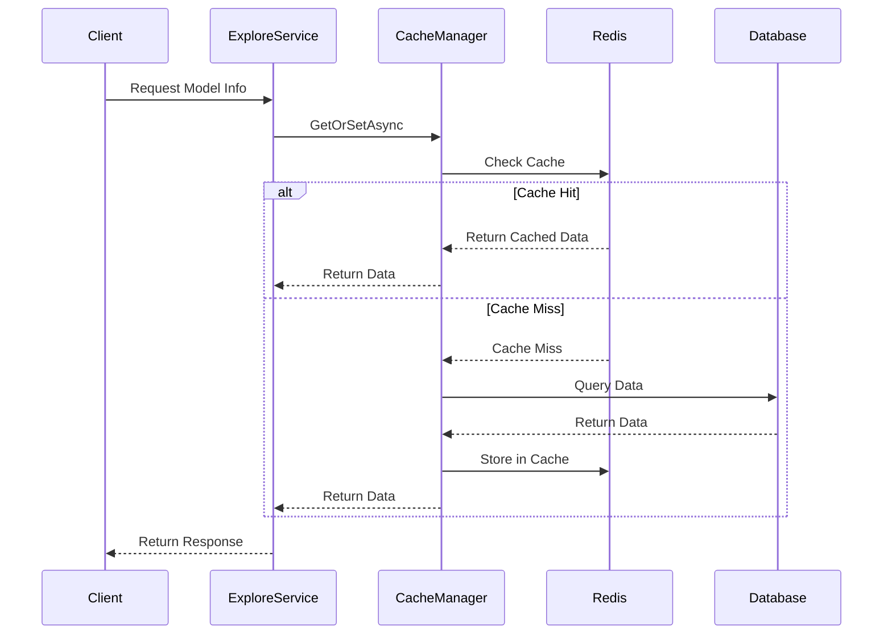
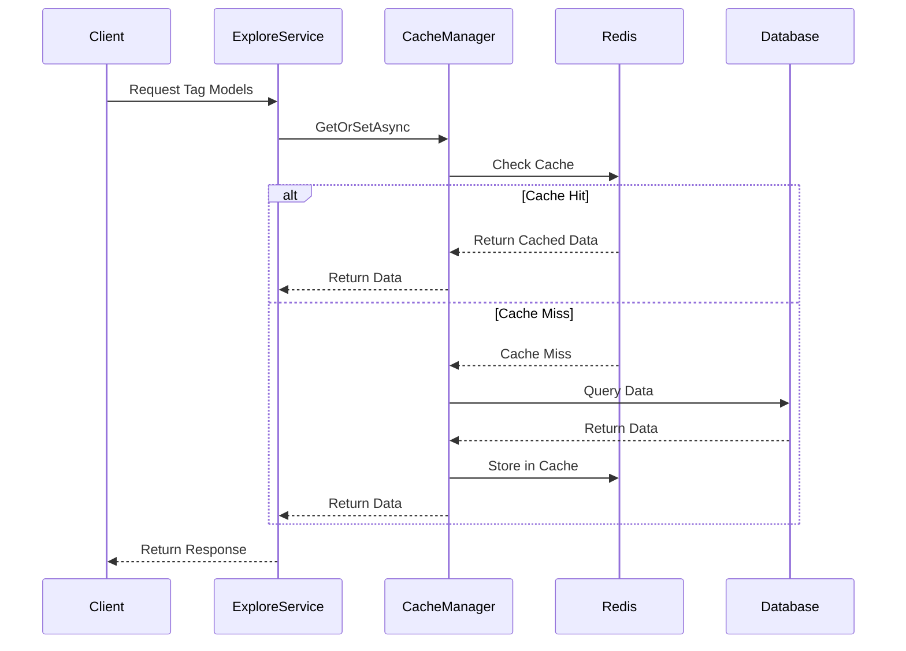

## Classes
  
### 1. CacheKeys

* Static class containing Redis keys as properties with declared values
* Keys for needed DTOs  

**مثال بس **
```c#
public static class CacheKeys
{
    public const string ModelList = "models:list:page:{0}:size:{1}";
    public const string ModelInfo = "models:info:{0}"; // {0} = modelId
    public const string ModelTags = "models:tags";
}
```

  

### 2. RedisCacheService
**جينيريك عشان استعمله مع ال DTOs**
* Generic class for Cache Methods 

* ال Methods اللي فيه :
	1. GetAsync<T>
	2. SetAsync<T>
	3. RemoveAsync
	4. ExistsAsync


* Error handling and logging


* JSON serialization/deserialization
ريديس بيقرا الكلام (json) فا محتاجين نعمل serialize و deserialize كل ما نبعتله حاجه  

* Connection management
  

### 3. CacheManager
دا الوسيط اللي الservice هتنادي عليه يكلم الcache او ال DB علي حسب لقا حاجه ولا لا 
حاجه زي helper كده

* Manages caching logic for Explore service

* Methods:
	- GetOrSetAsync<T>
	- InvalidateCache
	- ClearCache


* Cache hit/miss handling
دا بقا اللي هيكلم الداتا بيز لو ملقاش في الكاش 
* Database fallback
* Cache expiration management

  

### 4. ExploreService (Enhanced)
دا ال explore service العادي بس هنا بقا ال methods بدل ما هي بتنادي علي ال repo هتنادي علي ال cachemanager اللي فيه get و set 
  

## Method Implementations

  

### AvailableModels


  

### ModelInfo



  

### GetTagModels



  

### GetTags


  


## Order

1. RedisCacheService

2. CacheKeys

3. CacheManager

4. ExploreService integration

5. Health check

6. Cache invalidation


## Configuration

```json
{
"RedisCacheSettings": {
"ConnectionString": "localhost:6379",
"InstanceName": "ExploreService_",
"DefaultExpirationMinutes": 30,
"ModelInfoExpirationMinutes": 60,
"TagExpirationMinutes": 360,
"SearchExpirationMinutes": 15
	}
}
```


---

   # دي مش مهمه دلوقت بس هنسيبها نطبقها لو لقينا وقت الاسبوع الي بعده ان شاء الله


## Health Check Implementation

- Endpoint to check Redis connection

- Verify cache operations

- Monitor cache hit/miss ratios

- Check memory usage

- Validate serialization/deserialization
  
---


## Cache Invalidation Strategy

  

### When to Invalidate

1.  **Model Updates**

- When model information is modified

- When model tags are changed

- When new models are added

  

2.  **Tag Updates**

- When tags are modified

- When tag-model relationships change

  
دي طرق المسح من الكاش لما  يتعدل علي الكلاسس في الداتابيز 
### Invalidation Methods

1.  **Direct Invalidation**

- Remove specific cache entries

- Use pattern matching for related entries

  

2.  **Time-based Invalidation**

- Set appropriate expiration times

- Different TTLs for different data types

  

3.  **Event-based Invalidation**

- Listen for model/tag update events

- Trigger cache cleanup

  
  

  

  