# Gateway Context Diagram Documentation

## Overview
This document provides a comprehensive Context Diagram for the Gateway project, showing the system as a whole and its interactions with external systems, users, and services.

## Diagram Description

The Context Diagram illustrates the following key elements:

### External Actors
- **End Users**: Access services through the Gateway
- **Administrators**: Manage the system, users, and models
- **DevOps Engineers**: Monitor and configure the Gateway

### Gateway System Components
- **API Gateway (Ocelot)**: Core routing engine
- **JWT Authentication**: Handles user authentication
- **Role Authorization Middleware**: Enforces role-based access control
- **Claims Forwarding Middleware**: Forwards user claims to downstream services
- **Configuration Loader**: Loads and combines configuration files
- **Configuration Change Monitor**: Monitors for configuration changes

### External Systems/Microservices
- **Authentication Service**: Handles user authentication and authorization
- **Administration Service**: Manages system administration functions
- **Exploration Service**: Provides model exploration capabilities
- **Conversation Service**: Handles conversation interactions

### Configuration Files
- **Service URLs**: Defines service endpoints
- **Role Authorization**: Maps endpoints to required roles
- **Service Routes**: Defines routing configuration for each service

### Data Flows
- Authentication requests and responses
- Service API calls
- User data and claims
- Configuration updates
- Monitoring data

## Key Interactions

1. **User Authentication Flow**:
   - End User sends authentication request to Gateway
   - Gateway routes to Authentication Service
   - Authentication Service validates credentials and returns JWT
   - Gateway returns JWT to End User

2. **Service Request Flow**:
   - End User sends request with JWT to Gateway
   - Gateway validates JWT and checks role authorization
   - Gateway forwards user claims to appropriate service
   - Service processes request and returns response
   - Gateway returns response to End User

3. **Configuration Update Flow**:
   - DevOps Engineer updates configuration files
   - Configuration Change Monitor detects changes
   - Configuration Loader reloads configuration
   - Gateway applies new configuration

## PlantUML Source Code

The following PlantUML code can be used to generate the Context Diagram:

```plantuml
@startuml Gateway Context Diagram

' Define styles
skinparam backgroundColor white
skinparam handwritten false
skinparam defaultTextAlignment center
skinparam componentStyle rectangle

' Color definitions
skinparam ActorBackgroundColor #E2F0D9
skinparam ActorBorderColor #82B366
skinparam ComponentBackgroundColor #DAE8FC
skinparam ComponentBorderColor #6C8EBF
skinparam CloudBackgroundColor #F8CECC
skinparam CloudBorderColor #B85450
skinparam ArrowColor #404040

' Title
title Gateway Context Diagram - OllamaNet Components

' External Actors
actor "End User" as EndUser
actor "Administrator" as Admin
actor "DevOps Engineer" as DevOps

' Gateway System
rectangle "Gateway System" as Gateway {
  component "API Gateway\n(Ocelot)" as OcelotGateway
  component "JWT Authentication" as JWTAuth
  component "Role Authorization\nMiddleware" as RoleAuth
  component "Claims Forwarding\nMiddleware" as ClaimsForward
  component "Configuration\nLoader" as ConfigLoader
  component "Configuration\nChange Monitor" as ConfigMonitor
  
  OcelotGateway --> JWTAuth : uses
  OcelotGateway --> RoleAuth : uses
  OcelotGateway --> ClaimsForward : uses
  OcelotGateway --> ConfigLoader : uses
  ConfigMonitor --> ConfigLoader : notifies
}

' External Systems/Microservices
cloud "Authentication\nService" as AuthService
cloud "Administration\nService" as AdminService
cloud "Exploration\nService" as ExploreService
cloud "Conversation\nService" as ConversationService

' Configuration Files
database "Configuration Files" as ConfigFiles {
  component "Service URLs" as ServiceUrls
  component "Role Authorization" as RoleConfig
  component "Service Routes" as ServiceRoutes
}

' Connections between actors and Gateway
EndUser --> Gateway : Accesses services
Admin --> Gateway : Manages system
DevOps --> Gateway : Monitors & configures
DevOps --> ConfigFiles : Updates

' Connections between Gateway and external systems
Gateway --> AuthService : Routes authentication requests
Gateway --> AdminService : Routes administration requests
Gateway --> ExploreService : Routes exploration requests
Gateway --> ConversationService : Routes conversation requests

' Configuration connections
ConfigFiles --> Gateway : Provides configuration
ConfigMonitor --> ConfigFiles : Monitors for changes

' Data flows
note right of EndUser
  - Authentication requests
  - Service API calls
  - User data
end note

note right of Admin
  - User management
  - Model management
  - System configuration
end note

note right of DevOps
  - Configuration updates
  - Monitoring data
  - System metrics
end note

note bottom of Gateway
  - Authenticates users
  - Authorizes requests based on roles
  - Routes requests to appropriate services
  - Forwards user claims to services
  - Monitors configuration changes
end note

@enduml
```

## How to Generate the Diagram

You can generate the diagram using one of the following methods:

1. **Online PlantUML Editor**:
   - Visit [PlantUML Online Editor](https://www.plantuml.com/plantuml/uml/)
   - Copy and paste the PlantUML code above
   - The diagram will be generated automatically

2. **Local PlantUML Installation**:
   - Install PlantUML (requires Java): https://plantuml.com/download
   - Run the command: `java -jar plantuml.jar ContextDiagram.puml`

3. **VS Code Extension**:
   - Install the PlantUML extension for VS Code
   - Open the .puml file and use Alt+D to preview

## Diagram Analysis

### Key Insights

1. **Centralized Authentication and Authorization**:
   - The Gateway handles authentication and authorization centrally
   - Role-based access control is enforced at the Gateway level
   - User claims are forwarded to downstream services

2. **Modular Configuration**:
   - Configuration is split into service-specific files
   - Service URLs are centralized and referenced using variables
   - Configuration changes are monitored and applied dynamically

3. **Single Entry Point**:
   - All client requests go through the Gateway
   - The Gateway routes requests to the appropriate service
   - This simplifies client development and provides a unified interface

### Security Considerations

1. **Authentication**: JWT-based authentication with proper validation
2. **Authorization**: Role-based access control for protected endpoints
3. **Claims Forwarding**: User identity securely forwarded to services

### Scalability Considerations

1. **Service Independence**: Services can be scaled independently
2. **Configuration Management**: Modular configuration supports scaling
3. **Gateway Performance**: Gateway must handle all traffic efficiently