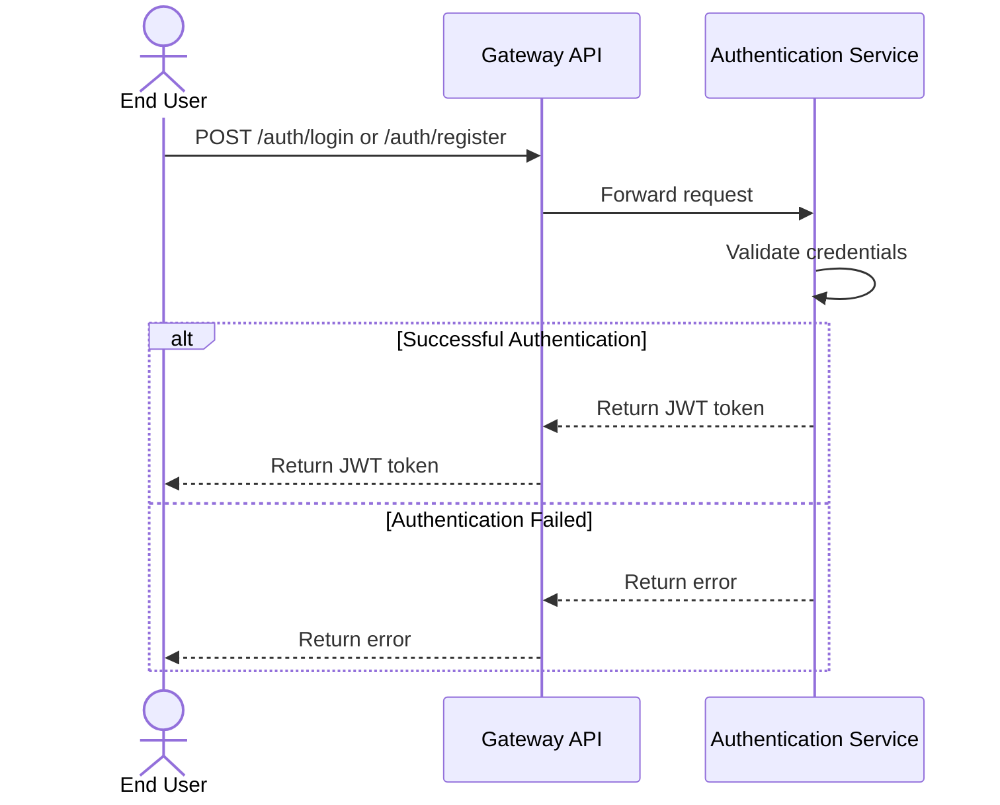
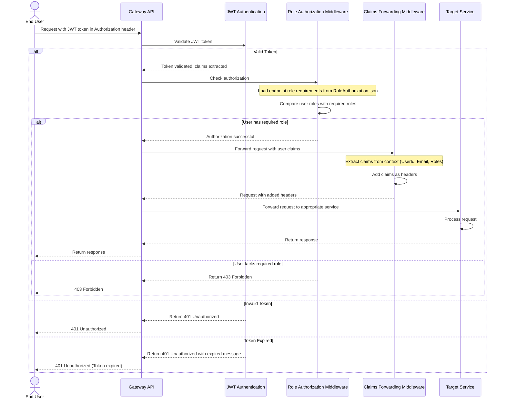
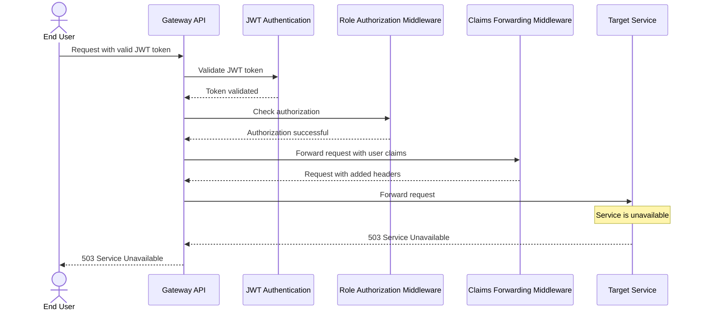
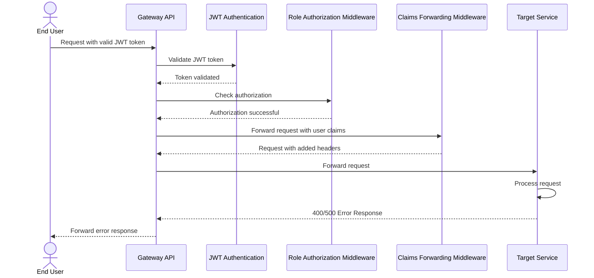

# Gateway Authentication and Authorization Flow (Mermaid)

This document contains the Mermaid version of the Gateway Authentication and Authorization flow sequence diagram. Mermaid provides a simpler visualization that can be rendered directly in markdown files.

## Authentication Flow (Login/Registration)

## Authenticated Request Flow (Happy Path)

## Service Unavailability Scenario

## Service Error Response Scenario

## Notes

- The Mermaid diagrams provide a simplified view of the sequence flow.
- For more detailed information, refer to the PlantUML diagram and documentation.
- These diagrams can be rendered directly in GitHub and other markdown viewers that support Mermaid.