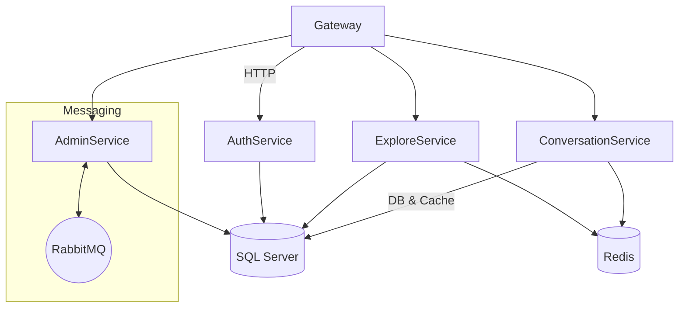

# System Patterns – OllamaNet

## Architectural Overview

### Pattern Catalogue
| Pattern | Where Applied | Rationale |
|---------|---------------|-----------|
| **Clean Architecture** | All services | Decouple domain/business logic from infrastructure. Facilitates unit testing & independent evolution. |
| **Repository Pattern** | `Ollama_DB_layer` | Abstracts SQL Server access; allows swap to other stores or mocking. |
| **Service Registration Extensions** | `ServiceExtensions.cs` in each service | Centralises DI wiring for readability. |
| **Resilience Policies (Polly)** | `RabbitMQResiliencePolicies`, Redis wrappers | Circuit-breaker & retry around external dependencies. |
| **Distributed Cache** | `RedisCacheService` | Reduce DB load & latency; TTL tuned per-domain. |
| **Server-Sent Events (SSE)** | Chat streaming endpoints | Low-latency, uni-directional stream suited for incremental LLM tokens. |
| **JWT Authentication** | Gateway + downstream | Stateless auth, roles encoded in claims, 30-day refresh flow. |
| **CI/CD GitHub Actions (planned)** | _future_ | Build, test, push images, deploy to K8s. |

## Component Responsibilities
1. **Gateway** – Single ingress; applies auth, rate-limiting, and forwards to downstream via Ocelot.
2. **AuthService** – User registration, login, token issuance, profile & password management.
3. **ConversationService** – CRUD conversations & messages, chat streaming, folder & note management.
4. **ExploreService** – Public catalogue of AI models & tags for discovery.
5. **AdminService** – Administrative operations: model lifecycle, tag CRUD, user & role ops, inference job control.

## Data Flow (Chat)
1. Client calls `POST /api/chats/stream` via Gateway with JWT.
2. Gateway validates token, forwards to ConversationService.
3. ConversationService queries cache; if miss, fetches context from SQL.
4. Service streams prompt to Ollama runtime; tokens forwarded to client via SSE.
5. Response cached (Redis) for subsequent retrieval.

## Cross-Cutting Concerns
* **Logging** – Structured JSON logs via `ILogger<>`; aggregated by external stack.
* **Validation** – FluentValidation for DTOs; automatically resolved by DI.
* **Error Handling** – Controller-level try/catch -> HTTP codes; custom exception hierarchies.
* **Monitoring** – `/health` endpoints per service; readiness & liveness probes.

---
*Last updated: {{date}}*